# BUMP.WIN - Squid Game for Meme Coins

> Bump. Survive. Win. Only the strongest meme survives.


## Squid Game–style Meme Launchpad

🏆 Winner-takes-all meme coin battle royale
📈 The one with the highest market cap wins.
💰 The champion takes all the liquidity and gets launched.
🔥 The other memes? Mercilessly burned.

---

🧠 Top 8 finalists selected via Decision Market (price = win probability)
🔐 Final winner determined in a Sealed Batch Auction, secured by Sui TLE (Time Locked Encryption)
💬 Shape outcomes with on-chain Chat
🌅 Sunrise Settlement: Winner emerges, new round begins

## Game Cycles


## Cash Flow

```mermaid
flowchart LR
    %% Meme Creators
    subgraph Creators
        C1["👷 Creator 1"]
        C2["👷 Creator 2"]
    end

    %% Traders
    subgraph Traders
        T1["🧑‍💻 Trader X"]
        T2["🧑‍💻 Trader Y"]
        T3["🧑‍💻 Trader Z"]
    end

    %% Champion Market
    subgraph Champion_Market["🏆 Champion Market"]
        WIN(["🥇Champion Meme A"])
    end

    %% Battle Market
    subgraph Battle_Market["🏟️ Battle Market"]
        M1([🪙 Meme Coin A])
        M2([🪙 Meme Coin B])
        M3([🪙 Meme Coin C])
    end

    %% Burned Coins
    subgraph Burned["🔥 Burned"]
        BURN2(["Dead Meme B"])
        BURN3(["Dead Meme C"])
    end

    %% LOSER Pool
    subgraph LOSER_POOL["🪦 Loser Staking"]
        LOSER(["💀 LOSER Coin"])
    end

    %% Creator → Meme
    C1 -.->|🛠️ create| M1
    C2 -.->|🛠️ create| M2

    %% Trader → Stake
    T1 ==💧 stake SUI==> M1
    T2 ==💧 stake SUI==> M2
    T3 ==💧 stake SUI==> M1

    %% Winner Flow
    M1 -.->|"🏆 selected winner"| WIN
    Battle_Market ==💧💧💧 All Liquidity==> Champion_Market

    %% Burn Flow
    M2 -.->|"🔥 eliminated"| BURN2
    M3 -.->|"🔥 eliminated"| BURN3

    %% Conversion to LOSER Coin
    BURN2 -.->|"turned into"| LOSER
    BURN3 -.->|"turned into"| LOSER

    %% Trading Fee Flow (solid line)
    Battle_Market -->|💸 trading fee| LOSER_POOL
    Champion_Market -->|💸 trading fee| LOSER_POOL
```



## Technical Innovation

- **Brier Score Dual SCPM**: Multi-outcome prediction market where prices always sum to 100%
- **Time-Locked Encryption**: Sui's Seal prevents manipulation during final auction
- **LOSER Tokenomics**: Protocol fees distributed to losers

## What's Built

```
packages/
├── battle_market/    # Brier Score Dual SCPM implementation
├── champ_market/     # CPMM (x*y=k) for winner's pool
├── justchat/         # Messaging with SUI payments
├── safemath/         # Safe arithmetic (u64, u128, i32)
└── mockcoins/        # Test tokens
```

## Quick Start

```bash
npm install bumpwin
```

See `suigen-configs/testnet.toml` for deployment addresses.

---

*In the attention economy, only the strongest meme survives.*
