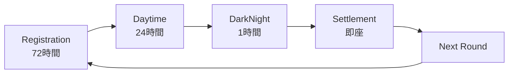

# システム概要

## ビジョン

BUMP.WINは、**ミームコインバトルロワイヤル**プロトコルです。複数のミームコインが生存を賭けて競争し、最後に残った1つのコインが全流動性を獲得する、公平で透明な市場メカニズムを提供します。

## 核心的価値提案

### 1. **真の価格発見**
- Brier Score Dual SCPMによる数学的に厳密な価格形成
- 決定市場理論に基づく真の確率反映
- 操作耐性のある価格メカニズム

### 2. **暗号学的公平性**
- Time-Locked Encryption（TLE）による情報対称性
- Sealed Batch Auctionでフロントランニング防止
- 決定論的勝者選出

### 3. **経済的持続性**
- Winner-takes-all による価値集中
- LOSER tokenによる敗者補償
- 手数料還元によるプロトコル持続性

## システムライフサイクル



### フェーズ詳細

| フェーズ | 期間 | 目的 | 主要メカニズム |
|---------|------|------|----------------|
| **Registration** | 72時間 | ミームコイン登録 | コミュニティ構築、初期流動性 |
| **Daytime** | 24時間 | 価格発見・競争 | Brier Score SCPM、公開取引 |
| **DarkNight** | 1時間 | 最終決戦 | Sealed Batch Auction、TLE |
| **Settlement** | 即座 | 勝者確定・清算 | ChampCoin発行、LOSER配布 |

## 参加者とインセンティブ

### **ミーム作成者**
- **動機**: 自身のミームコインを勝利に導く
- **戦略**: コミュニティ構築、マーケティング
- **報酬**: 勝利時の流動性獲得

### **投資家・トレーダー**
- **動機**: 勝者予測による利益獲得
- **戦略**: 価格分析、情報収集、タイミング
- **報酬**: 勝者シェア保有による価値上昇

### **LOSER保有者**
- **動機**: プロトコル手数料による安定収入
- **戦略**: LOSERステーキング
- **報酬**: 全取引手数料の100%分配

## 経済モデル概要

### **価値フロー**
```
参加者投資 → Battle Vault → 勝者コイン → ChampCoin → AMM価値
                    ↓
               敗者補償 → LOSER Token → ステーキング報酬
```

### **手数料構造**
- **取引手数料**: 1%（全額LOSER保有者へ）
- **Withdraw手数料**: 0-48%（時間経過で増加）
- **登録手数料**: スパム防止用少額

### **価値実現メカニズム**
1. **勝者**: Share → ChampCoin → AMM価格で価値上昇
2. **敗者**: LOSER Token → 手数料分配で長期価値
3. **プロトコル**: 取引量増加による手数料増

## 技術アーキテクチャ概要

### **コア技術スタック**
- **ブロックチェーン**: Sui Network
- **言語**: Move
- **暗号化**: Time-Locked Encryption（Sui Seal）
- **AMM**: Order Book Inspired Market Making（OBMM）

### **主要モジュール**
```
┌─────────────────┐    ┌─────────────────┐
│  Decision       │    │  Sealed Batch  │
│  Market         │    │  Auction        │
│  (Brier Score)  │    │  (TLE)          │
└─────────────────┘    └─────────────────┘
         │                       │
         └───────┬───────────────┘
                 │
    ┌─────────────────┐    ┌─────────────────┐
    │  Battle Vault   │    │  Settlement     │
    │  (Core Data)    │    │  Engine         │
    └─────────────────┘    └─────────────────┘
                                    │
              ┌─────────────────────┼─────────────────────┐
              │                     │                     │
    ┌─────────────────┐    ┌─────────────────┐    ┌─────────────────┐
    │  Champion AMM   │    │  ChampCoin      │    │  LOSER Token    │
    │  (OBMM)         │    │  System         │    │  Distribution   │
    └─────────────────┘    └─────────────────┘    └─────────────────┘
```

## 競合優位性

### **vs 既存ミームコインプラットフォーム**
- **pump.fun**: より公平な価格発見、暗号学的操作防止
- **Uniswap**: 目的特化設計、ゲーム理論最適化
- **決定市場**: エンターテイメント性、コミュニティ参加

### **独自価値**
1. **数学的厳密性**: Brier Score理論による価格保証
2. **暗号学的保護**: TLEによる完全な情報対称性
3. **経済設計**: Winner-takes-allによる価値集中効果

## 将来展望

### **短期目標（3-6ヶ月）**
- Sui testnet デプロイ
- コミュニティテスト
- 初期ラウンド実施

### **中期目標（6-12ヶ月）**
- Sui mainnet ローンチ
- 大規模ラウンド実施
- クロスチェーン展開検討

### **長期ビジョン（1-2年）**
- 多様なアセットクラス対応
- DAOガバナンス移行
- エコシステム拡張

---

**次**: [経済モデル](./02-economic-model.md)