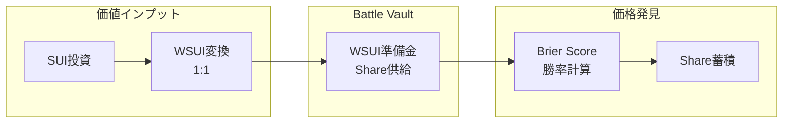
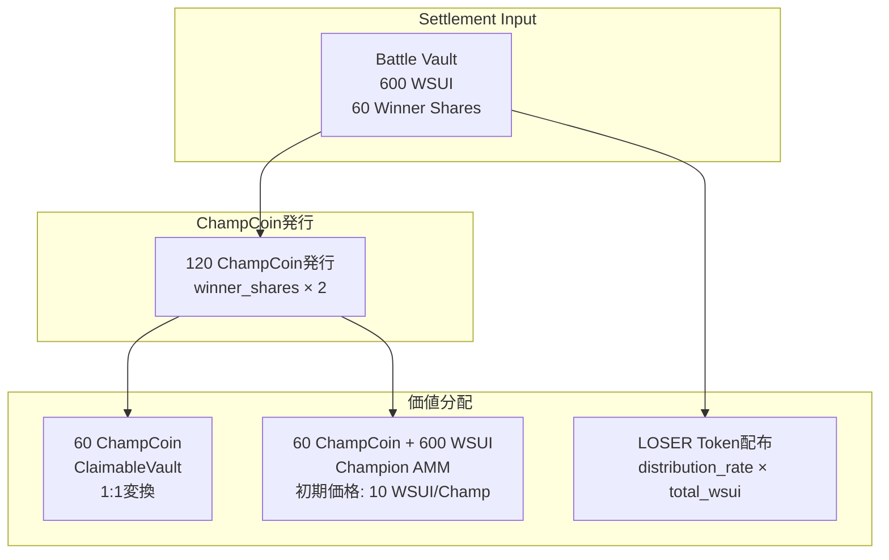

# 経済モデル

## 基本原理

### **Winner-Takes-All 原則**
BUMP.WINの経済モデルは「勝者総取り」を核心とします。これにより価値の集中と明確なインセンティブ構造を実現します。

### **価値保存と創造**
```
入力価値 = 出力価値 + プロトコル手数料
勝者価値上昇 = 市場メカニズムによる実現（新規価値創造なし）
```

## 価値フロー詳細

### **Phase 1-3: 価値蓄積**


### **Phase 4: 価値分配**


## 価値上昇メカニズム

### **数値例: 60%勝率の場合**

| 段階 | Winner Share価値 | 説明 |
|------|------------------|------|
| **Battle中** | 6 WSUI/share | `(60% × total_wsui) / total_shares` |
| **Settlement後** | 10 WSUI/ChampCoin | `total_wsui / winner_shares = 600/60` |
| **価値上昇率** | +67% | `10/6 - 1 = 0.67` |

### **価値上昇の源泉**
```
Battle中の理論価値: 60% × (600 WSUI / 100 shares) = 3.6 WSUI/share
Settlement価値: 600 WSUI / 60 shares = 10 WSUI/ChampCoin
上昇倍率: 10 / 3.6 = 2.78倍
```

**重要**: この価値上昇は新規価値創造ではなく、決定市場メカニズムによる価値の再配分です。

## 手数料構造

### **取引手数料（1%）**
```
全取引 → 1%手数料 → 100% LOSER保有者へ分配
```

**対象取引**:
- Decision Market での buy/sell
- Champion AMM での swap
- 将来のクロスマーケット取引

### **時間依存Withdraw手数料**
```
手数料率 = (経過時間 / 24時間) × 48%
例: 12時間経過 → 24%手数料
```

**目的**: 早期退出を抑制し、市場の安定性を向上

### **手数料配布メカニズム**
```move
// 概念的な配布ロジック
fee_collected → LOSER_staking_pool
distribution_per_loser = fee_collected / total_staked_loser
```

## 参加者別経済分析

### **勝者（Winner Share保有者）**

**投入**: 
- x WSUI → y Share<Winner>

**獲得**:
- y ChampCoin（ClaimableVault経由）
- AMM価格による価値: `y × (total_wsui / winner_shares)`

**期待リターン**:
```
ROI = (ChampCoin価値 - 投入WSUI) / 投入WSUI
    = (winner_shares_ratio⁻¹ - investment_ratio) / investment_ratio
```

### **敗者（Loser Share保有者）**

**投入**:
- x WSUI → 0（損失）

**獲得**:
- LOSER Token: `(投入額 / 敗者総投入額) × total_loser_distribution`

**LOSER Token価値**:
```
NPV = Σ(年間手数料分配 / (1 + discount_rate)ᵗ)
```

### **LOSER保有者（既存）**

**獲得**:
- 全プロトコル手数料の100%
- 複利効果による長期価値蓄積

**ステーキング報酬率**:
```
APY = (年間総手数料 / 総LOSER供給量) × 100%
```

## 経済パラメータ

### **LOSER配布レート（逓減）**
```move
initial_rate = 100_000; // 初期: 100 LOSER per 1 WSUI
final_rate = 1_000;     // 最終: 1 LOSER per 1 WSUI  
total_rounds = 100;     // 100ラウンドで最小値に

current_rate = initial_rate - 
    ((initial_rate - final_rate) × round_number / total_rounds)
```

### **価格インパクト係数**
- **Decision Market**: Brier Score二次関数
- **Champion AMM**: OBMM平方根インパクト
- **Withdraw**: 線形時間依存

## リスク分析

### **勝者側リスク**
1. **予測失敗**: 投資額100%損失
2. **後期参入**: 高価格での購入リスク
3. **流動性リスク**: AMM価格変動

### **LOSER保有者リスク**
1. **手数料減少**: プロトコル利用量減少
2. **インフレ**: 新規LOSER発行による希薄化
3. **競合**: 類似プロトコルによるユーザー流出

### **プロトコルリスク**
1. **Death Spiral**: 参加者減少 → 手数料減少 → LOSER価値下落
2. **Whale操作**: 大口による市場操作（TLEで緩和）
3. **技術リスク**: スマートコントラクト脆弱性

## 持続性メカニズム

### **ネットワーク効果**
```
参加者増加 → 取引量増加 → 手数料増加 → LOSER価値上昇 → より多くの参加者
```

### **価値捕獲**
- 全手数料のLOSER保有者への還元
- Champion AMM永続化による長期価値
- クロスマーケット効果による流動性向上

### **適応メカニズム**
- LOSER配布レートの逓減
- 手数料率の動的調整可能性
- 新機能追加によるユーザー価値向上

---

**次**: [コアデータ構造](./03-core-data-structures.md)