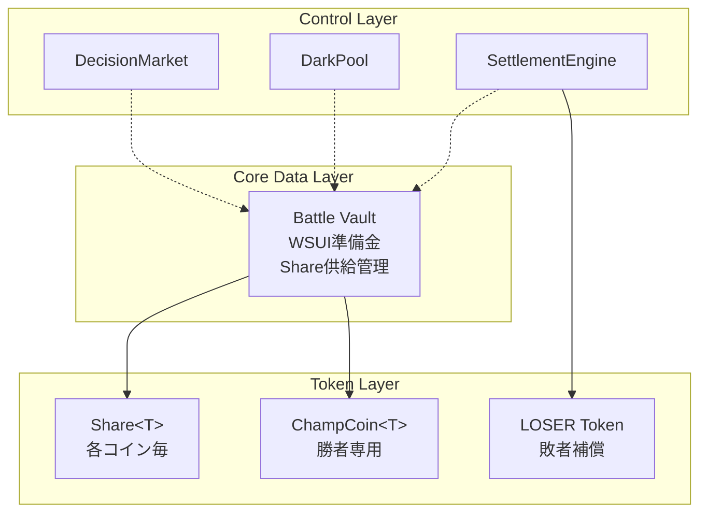

# コアデータ構造

## アーキテクチャ概要

BUMP.WINのアーキテクチャは、**Battle Vault**を中心とした統一設計です。全てのフェーズでこの中核データ構造を軸に、フェーズ固有の制御層が連携します。



## 1. Battle Vault（中核データ構造）

### **定義**
```move
/// 中心的なデータ金庫
/// 全フェーズを通じてWSUI準備金とShare供給を管理
public struct BattleVault has key, store {
    id: UID,
    /// WSUI準備金（SUIをラップした取引通貨）
    wsui_reserve: Balance<WSUI>,
    /// 各コインのShare供給管理
    share_supplies: ObjectBag, // TypeName → Supply<Share<T>>
    /// 登録されたアウトカム数
    num_outcomes: u64,
    /// 総シェア数（キャッシュ）
    total_shares: u128,
    /// ラウンド識別子
    round_id: u64,
}
```

### **責任範囲**
1. **準備金管理**: 全参加者投資WSUIの安全な保管
2. **Share供給**: 各コインのトークン供給量制御
3. **会計**: 総投資額と総シェア数の追跡
4. **移管**: フェーズ間での安全な所有権移転

### **生存期間**
```
作成: Registration開始時
移管: DecisionMarket → DarkPool → SettlementEngine
消滅: Settlement完了後（内容は各システムに分散）
```

## 2. フェーズ制御構造

### **DecisionMarket（決定市場制御）**
```move
/// Daytimeフェーズの市場制御
public struct DecisionMarket has key {
    id: UID,
    /// 制御対象のVault
    vault: BattleVault,
    /// 登録済みコインタイプ
    registered_coins: vector<TypeName>,
    /// 市場開始時刻
    market_start_ms: u64,
    /// 市場終了時刻
    market_end_ms: u64,
}
```

**機能**:
- Brier Score価格計算
- Share売買処理
- 時間制御による取引制限

### **DarkPool（暗号化オークション制御）**
```move
/// DarkNightフェーズのSBA制御
public struct DarkPool has key {
    id: UID,
    /// 制御対象のVault（DecisionMarketから移管）
    vault: BattleVault,
    /// Finalist 8コイン
    finalist_coins: vector<TypeName>,
    /// 固定変換レート（1 share = X WSUI）
    wsui_per_share: u64,
    /// 全バッチID（事前作成）
    batch_ids: vector<ID>,
    /// 現在受付中バッチ
    current_batch: u8,
    /// DarkNight開始/終了時刻
    darknight_start_ms: u64,
    darknight_end_ms: u64,
    /// 完了フラグ
    is_completed: bool,
}
```

**機能**:
- TLE暗号化注文処理
- 固定レートでのShare発行
- バッチタイミング制御

### **SettlementEngine（決済制御）**
```move
/// Settlementフェーズの清算制御
public struct SettlementEngine has key {
    id: UID,
    /// ラウンド番号
    round_number: u64,
    /// 決済完了フラグ
    is_settled: bool,
    /// 勝者コインタイプ
    winner_coin_type: Option<TypeName>,
    /// LOSER配布レート
    loser_distribution_rate: u64,
}
```

**機能**:
- 勝者決定ロジック
- ChampCoin発行と分配
- LOSER配布実行

## 3. トークン構造

### **Share<T>（シェアトークン）**
```move
/// 各ミームコインに対応するシェアトークン
public struct Share<phantom T> has store {
    // phantom: 型レベルでのコイン識別のみ
    // 実データなし（ゼロコスト抽象化）
}
```

**特徴**:
- **phantom type**: 実行時データなし、型安全性のみ
- **has store**: Balance<Share<T>>での管理可能
- **Supply管理**: BattleVault内のObjectBagで集中管理

### **ChampCoin<T>（チャンピオンコイン）**
```move
/// 勝者専用の変換後トークン
public struct ChampCoin<phantom T> has store {
    // phantom: 元のコインタイプを型レベルで保持
}

/// ChampCoin供給管理
public struct ChampCoinSupply<phantom T> has key {
    id: UID,
    /// 元のコインタイプ情報
    original_coin_type: TypeName,
    /// ラウンド番号
    round_number: u64,
    /// 供給制御
    supply: Supply<ChampCoin<T>>,
    /// 総発行量（winner_shares × 2）
    total_supply: u64,
}
```

### **ClaimableVault（請求可能金庫）**
```move
/// 勝者のChampCoin請求権管理
public struct ClaimableVault has key {
    id: UID,
    /// 対象ラウンド
    round_number: u64,
    /// ChampCoin残高（50%分）
    champ_balance: Balance<ChampCoin<T>>,
    /// Share保有者別の請求権
    claim_rights: Table<address, u64>,
    /// 請求済み記録
    claimed_records: Table<address, bool>,
}
```

### **LOSER Token**
```move
/// 敗者補償トークン
public struct LOSER has drop {
    // 標準的なfungible token
}

/// LOSER供給管理とステーキング
public struct LOSERSupply has key {
    id: UID,
    /// 供給制御
    supply: Supply<LOSER>,
    /// 総発行上限
    max_supply: u64,
    /// 現在発行済み量
    total_minted: u64,
    /// ステーキングプール
    staking_pool: Balance<LOSER>,
    /// 手数料蓄積プール
    fee_accumulator: Balance<WSUI>,
}
```

## 4. データフロー

### **Vault移管パターン**
```move
// Phase 1→2: Registration → Daytime
let vault = create_battle_vault(ctx);
let decision_market = DecisionMarket {
    vault, // 所有権移転
    // ... other fields
};

// Phase 2→3: Daytime → DarkNight
let DecisionMarket { vault, ... } = decision_market; // 分解して取得
let dark_pool = DarkPool {
    vault, // 所有権移転
    // ... other fields
};

// Phase 3→4: DarkNight → Settlement
let DarkPool { vault, ... } = dark_pool; // 分解して取得
settle_and_distribute(vault, settlement_engine);
```

### **Share管理パターン**
```move
// Battle Vault内でのShare供給管理
public fun mint_shares<T>(
    vault: &mut BattleVault,
    amount: u64,
    ctx: &mut TxContext
): Balance<Share<T>> {
    let type_name = type_name::get<T>();
    let supply = vault.share_supplies.borrow_mut<TypeName, Supply<Share<T>>>(type_name);
    supply.increase_supply(amount)
}

// 個人残高での管理（アカウント外）
public struct UserSharePortfolio has key {
    id: UID,
    owner: address,
    balances: Table<TypeName, Balance<Share<T>>>,
}
```

## 5. 型安全性保証

### **Phantom Types活用**
```move
// 型レベルでのコイン区別
Share<COIN_A> ≠ Share<COIN_B> ≠ Share<COIN_C>

// 実行時エラー防止
public fun switch_shares<From, To>(
    from_shares: Balance<Share<From>>,
    vault: &mut BattleVault,
    ctx: &mut TxContext
): Balance<Share<To>> {
    // From ≠ To が型レベルで保証される
}
```

### **能力制御**
```move
// 適切な能力設定によるアクセス制御
Share<T>: has store      // Balance格納可能
BattleVault: has key, store  // オブジェクト格納・移管可能
ChampCoin<T>: has store  // AMM対応
LOSER: has drop         // 自由転送可能
```

## 6. ガス効率化

### **メモ化戦略**
```move
// 総シェア数のキャッシュ
total_shares: u128,  // 毎回計算せずキャッシュ

// 型別アクセス最適化
share_supplies: ObjectBag,  // TypeName→Supply の高速マップ
```

### **バッチ処理**
```move
// 複数Share操作の一括実行
public fun batch_mint_shares(
    vault: &mut BattleVault,
    requests: vector<MintRequest>,
    ctx: &mut TxContext
): vector<Balance<Share<T>>> {
    // 一度のトランザクションで複数処理
}
```

---

**次**: [フェーズ遷移](./04-phase-transitions.md)
