# フェーズ遷移システム

## 概要

BUMP.WINは4つの明確なフェーズを持つ状態機械として設計されています。各フェーズ間の遷移は決定論的で、Battle Vaultの所有権移転を中心とした原子的操作で実現されます。

```mermaid
stateDiagram-v2
    [*] --> Registration
    Registration --> Daytime: 72時間経過
    Daytime --> DarkNight: 24時間経過
    DarkNight --> Settlement: 1時間経過
    Settlement --> [*]: 清算完了

    state Registration {
        [*] --> VaultCreation
        VaultCreation --> CoinRegistration
        CoinRegistration --> InitialLiquidity
        InitialLiquidity --> [*]
    }

    state Daytime {
        [*] --> MarketOpen
        MarketOpen --> PriceDiscovery
        PriceDiscovery --> Finalist8Selection
        Finalist8Selection --> [*]
    }

    state DarkNight {
        [*] --> RateFixing
        RateFixing --> Batch1
        Batch1 --> Batch2
        Batch2 --> Batch3
        Batch3 --> Batch4
        Batch4 --> Batch5
        Batch5 --> [*]
    }

    state Settlement {
        [*] --> WinnerDetermination
        WinnerDetermination --> ChampCoinMinting
        ChampCoinMinting --> AMMMCreation
        AMMMCreation --> LOSERDistribution
        LOSERDistribution --> [*]
    }
```



## Phase 1: Registration（登録フェーズ）

### **目的と期間**
- **期間**: 72時間
- **目的**: ミームコイン登録とコミュニティ構築
- **参加者**: ミーム作成者、早期サポーター

### **状態遷移**
```move
/// Phase 1 開始: Battle Vault作成
public fun initialize_registration(
    round_number: u64,
    ctx: &mut TxContext
): BattleVault {
    BattleVault {
        id: object::new(ctx),
        wsui_reserve: balance::zero(),
        share_supplies: object_bag::new(ctx),
        num_outcomes: 0,
        total_shares: 0,
        round_id: round_number,
    }
}

/// ミームコイン登録
public fun register_coin<T>(
    vault: &mut BattleVault,
    ctx: &mut TxContext
) {
    let coin_type = type_name::get<T>();
    assert!(!vault.share_supplies.contains(coin_type), E_ALREADY_REGISTERED);

    // Share供給を作成
    let share_supply = balance::create_supply(Share<T> {});
    vault.share_supplies.add(coin_type, share_supply);
    vault.num_outcomes = vault.num_outcomes + 1;
}
```

### **経済活動**
- **コイン登録**: スパム防止用少額手数料
- **初期投資**: 早期サポーターによる初期流動性提供
- **コミュニティ構築**: マーケティング、情報発信

### **Phase 1 → 2 遷移条件**
```move
public fun transition_to_daytime(
    vault: BattleVault,
    clock: &Clock,
    ctx: &mut TxContext
): DecisionMarket {
    let current_time = clock::timestamp_ms(clock);

    // 時間条件確認
    assert!(current_time >= registration_end_time, E_REGISTRATION_NOT_ENDED);

    // 最小参加者数確認
    assert!(vault.num_outcomes >= MIN_PARTICIPANTS, E_INSUFFICIENT_PARTICIPANTS);

    DecisionMarket {
        id: object::new(ctx),
        vault, // 所有権移転
        registered_coins: extract_registered_coins(&vault),
        market_start_ms: current_time,
        market_end_ms: current_time + DAYTIME_DURATION_MS,
    }
}
```

## Phase 2: Daytime（日中取引フェーズ）

### **目的と期間**
- **期間**: 24時間
- **目的**: Brier Score決定市場による価格発見
- **参加者**: トレーダー、投資家、コミュニティ

### **制御構造**
```move
/// Daytime制御: Decision Market
public struct DecisionMarket has key {
    id: UID,
    vault: BattleVault,
    registered_coins: vector<TypeName>,
    market_start_ms: u64,
    market_end_ms: u64,
}
```

### **主要操作**
```move
/// Share購入（Brier Score価格）
public fun buy_shares<T>(
    market: &mut DecisionMarket,
    payment: Coin<WSUI>,
    ctx: &mut TxContext
): Coin<Share<T>> {
    // 時間制限確認
    assert!(is_market_active(market, clock), E_MARKET_CLOSED);

    // 現在の価格計算（Brier Score）
    let current_shares = get_current_shares<T>(&market.vault);
    let shares_to_mint = calculate_brier_score_swap(
        current_shares,
        market.vault.total_shares,
        payment.value(),
        market.vault.num_outcomes
    );

    // Vault更新
    market.vault.wsui_reserve.join(payment.into_balance());
    let new_shares = mint_shares<T>(&mut market.vault, shares_to_mint, ctx);
    market.vault.total_shares = market.vault.total_shares + shares_to_mint;

    coin::from_balance(new_shares, ctx)
}

/// Share売却
public fun sell_shares<T>(
    market: &mut DecisionMarket,
    shares: Coin<Share<T>>,
    ctx: &mut TxContext
): Coin<WSUI> {
    // Brier Score逆計算でWSUI算出
    let wsui_amount = calculate_brier_score_sell(
        shares.value(),
        get_current_shares<T>(&market.vault),
        market.vault.total_shares,
        market.vault.num_outcomes
    );

    // Vault更新
    burn_shares<T>(&mut market.vault, shares.into_balance());
    market.vault.total_shares = market.vault.total_shares - shares.value();

    let wsui_payout = market.vault.wsui_reserve.split(wsui_amount);
    coin::from_balance(wsui_payout, ctx)
}
```

### **Phase 2 → 3 遷移条件**
```move
public fun transition_to_darknight(
    market: DecisionMarket,
    clock: &Clock,
    ctx: &mut TxContext
): DarkPool {
    let current_time = clock::timestamp_ms(clock);
    assert!(current_time >= market.market_end_ms, E_DAYTIME_NOT_ENDED);

    // DecisionMarket分解
    let DecisionMarket {
        id,
        vault,
        registered_coins,
        ..
    } = market;
    object::delete(id);

    // Finalist 8選出
    let finalist8 = select_top_8_coins(&vault, &registered_coins);

    // 固定レート計算
    let wsui_per_share = vault.wsui_reserve.value() / (vault.total_shares as u64);

    DarkPool {
        id: object::new(ctx),
        vault, // 所有権移転
        finalist_coins: finalist8,
        wsui_per_share,
        batch_ids: create_all_batches(current_time, ctx),
        current_batch: 1,
        darknight_start_ms: current_time,
        darknight_end_ms: current_time + DARKNIGHT_DURATION_MS,
        is_completed: false,
    }
}
```

## Phase 3: DarkNight（暗号化オークションフェーズ）

### **目的と期間**
- **期間**: 1時間（5バッチ × 12分）
- **目的**: TLE暗号化による公平な最終価格決定
- **参加者**: Finalist 8保有者

### **制御構造**
```move
/// DarkNight制御: Dark Pool + Trading Batches
public struct DarkPool has key {
    id: UID,
    vault: BattleVault,
    finalist_coins: vector<TypeName>, // 上位8コインのみ
    wsui_per_share: u64, // 固定変換レート
    batch_ids: vector<ID>, // 5つのバッチ
    current_batch: u8, // 1-5
    darknight_start_ms: u64,
    darknight_end_ms: u64,
    is_completed: bool,
}

public struct TradingBatch has key {
    id: UID,
    darkpool_id: ID,
    batch_index: u8,
    start_time_ms: u64,
    end_time_ms: u64,
    sealed_orders: Table<address, vector<SealedOrder>>,
    is_executed: bool,
}
```

### **バッチ実行サイクル**
```move
/// バッチ終了時の一括実行
public fun execute_batch(
    darkpool: &mut DarkPool,
    batch: &mut TradingBatch,
    clock: &Clock,
    ctx: &mut TxContext
) {
    assert!(clock::timestamp_ms(clock) >= batch.end_time_ms, E_BATCH_NOT_ENDED);
    assert!(!batch.is_executed, E_ALREADY_EXECUTED);

    // 全暗号化注文をTLE復号
    let addresses = batch.sealed_orders.keys();
    let i = 0;
    while (i < addresses.length()) {
        let user_orders = batch.sealed_orders.borrow(&addresses[i]);
        let j = 0;
        while (j < user_orders.length()) {
            let order = &user_orders[j];

            // TLE復号（バッチ終了時刻で復号可能に）
            let decrypted = decrypt_sealed_order(order, batch.end_time_ms);
            let (coin_type, wsui_amount) = parse_order_data(decrypted);

            // 固定レートでShare発行
            let shares_amount = wsui_amount / darkpool.wsui_per_share;
            execute_fixed_rate_mint(
                &mut darkpool.vault,
                coin_type,
                shares_amount,
                &addresses[i],
                ctx
            );

            j = j + 1;
        };
        i = i + 1;
    };

    batch.is_executed = true;

    // 次バッチまたは完了
    if (darkpool.current_batch < TOTAL_BATCHES) {
        darkpool.current_batch = darkpool.current_batch + 1;
    } else {
        darkpool.is_completed = true;
    };
}
```

### **Phase 3 → 4 遷移条件**
```move
public fun transition_to_settlement(
    darkpool: DarkPool,
    settlement_engine: &mut SettlementEngine,
    clock: &Clock,
    ctx: &mut TxContext
) {
    assert!(darkpool.is_completed, E_DARKNIGHT_NOT_COMPLETED);

    // DarkPool分解
    let DarkPool { vault, finalist_coins, .. } = darkpool;

    // 勝者決定
    let winner_coin = determine_winner(&vault, &finalist_coins);
    settlement_engine.winner_coin_type = option::some(winner_coin);

    // Settlement実行
    execute_settlement(settlement_engine, vault, ctx);
}
```

## Phase 4: Settlement（決済フェーズ）

### **目的と期間**
- **期間**: 即座（原子的実行）
- **目的**: 勝者確定、価値分配、次ラウンド準備
- **参加者**: 全参加者（自動実行）

### **原子的決済処理**
```move
/// 原子的決済実行
public fun execute_settlement(
    engine: &mut SettlementEngine,
    vault: BattleVault,
    ctx: &mut TxContext
): (ChampionsMarket, ClaimableVault, LOSERDistribution) {
    assert!(!engine.is_settled, E_ALREADY_SETTLED);

    let winner_type = engine.winner_coin_type.borrow();
    let winner_shares = get_winner_shares(&vault, winner_type);

    // 1. ChampCoin発行（winner_shares × 2）
    let total_champ_supply = winner_shares * 2;
    let (amm_coins, claimable_coins) = mint_champ_coins(
        winner_type,
        total_champ_supply,
        ctx
    );

    // 2. Champions Market作成（50%）
    let champions_market = create_champions_market(
        vault.wsui_reserve,
        amm_coins,
        ctx
    );

    // 3. ClaimableVault作成（50%）
    let claimable_vault = create_claimable_vault(
        engine.round_number,
        claimable_coins,
        &vault,
        winner_type,
        ctx
    );

    // 4. LOSER配布
    let loser_distribution = distribute_loser_tokens(
        &vault,
        winner_type,
        engine.loser_distribution_rate,
        ctx
    );

    engine.is_settled = true;

    (champions_market, claimable_vault, loser_distribution)
}
```

## 遷移の原子性保証

### **所有権移転パターン**
```move
// パターン1: 構造体分解による移転
let SourceStruct { vault, other_fields, .. } = source_object;
let target_object = TargetStruct { vault, new_fields, .. };

// パターン2: 関数引数による移転
public fun transfer_vault(vault: BattleVault) -> NewContainer {
    NewContainer { vault }
}
```

### **エラーリカバリ**
```move
/// 遷移失敗時の安全な状態復元
public fun safe_phase_transition<T>(
    source: T,
    transition_fn: |T| -> Result<NextPhase, T>
): Result<NextPhase, T> {
    match transition_fn(source) {
        Ok(next_phase) => Ok(next_phase),
        Err(restored_source) => {
            // 元の状態に自動復元
            Err(restored_source)
        }
    }
}
```

### **時間制御**
```move
/// 精密な時間ベースフェーズ管理
public fun get_current_phase(
    round_start_time: u64,
    clock: &Clock
): RoundPhase {
    let elapsed = clock::timestamp_ms(clock) - round_start_time;

    if (elapsed < REGISTRATION_DURATION_MS) {
        RoundPhase::Registration
    } else if (elapsed < REGISTRATION_DURATION_MS + DAYTIME_DURATION_MS) {
        RoundPhase::Daytime
    } else if (elapsed < TOTAL_ROUND_DURATION_MS) {
        let darknight_elapsed = elapsed - REGISTRATION_DURATION_MS - DAYTIME_DURATION_MS;
        let batch_number = (darknight_elapsed / BATCH_DURATION_MS) + 1;
        RoundPhase::DarkNight { batch: (batch_number as u8) }
    } else {
        RoundPhase::Settlement
    }
}
```

## 状態検証

### **不変条件**
```move
/// 各フェーズで保持すべき不変条件
public fun verify_phase_invariants(phase: &RoundPhase, vault: &BattleVault) {
    // 基本不変条件
    assert!(vault.wsui_reserve.value() > 0, E_EMPTY_VAULT);
    assert!(vault.num_outcomes > 0, E_NO_PARTICIPANTS);

    match phase {
        RoundPhase::Registration => {
            // 登録フェーズ: 取引なし
            assert!(vault.total_shares == 0, E_PREMATURE_TRADING);
        },
        RoundPhase::Daytime => {
            // 日中フェーズ: 全コイン取引可能
            assert!(vault.total_shares > 0, E_NO_TRADING_ACTIVITY);
        },
        RoundPhase::DarkNight { .. } => {
            // 夜間フェーズ: Finalist 8のみ
            verify_finalist_only_trading(vault);
        },
        RoundPhase::Settlement => {
            // 決済フェーズ: 取引停止
            verify_settlement_readiness(vault);
        }
    }
}
```

---

**次**: [モジュールインターフェース](./05-module-interfaces.md)
