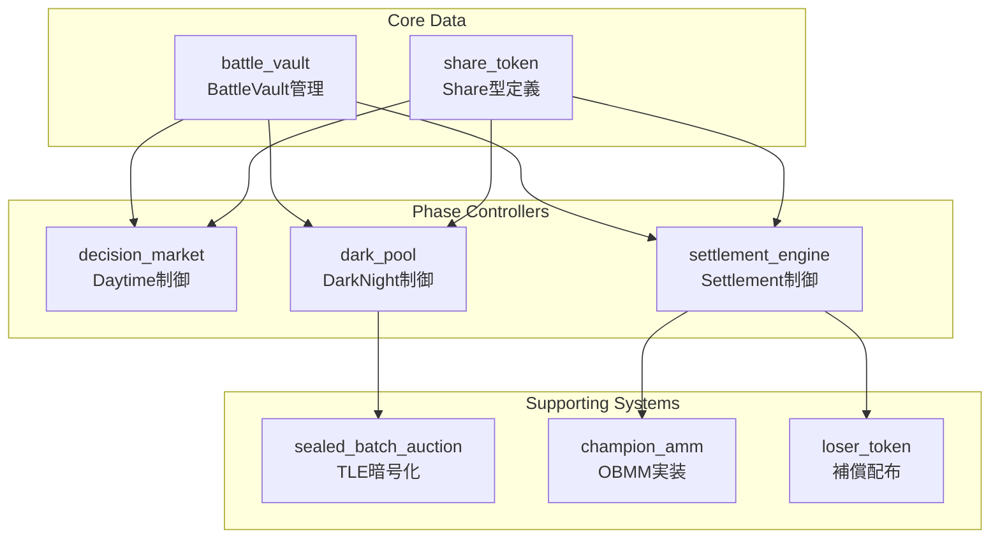

# モジュールインターフェース

## アーキテクチャ概要

BUMP.WINのモジュール設計は、**Battle Vault中心の依存関係**と**フェーズ制御の分離**を基本原則とします。各モジュールは明確な責任範囲を持ち、型安全なインターフェースで連携します。



## 1. battle_vault モジュール

### **責任範囲**
- Battle Vault構造体の定義と基本操作
- WSUI準備金の管理
- Share供給の集中管理
- フェーズ間移管の安全性保証

### **公開インターフェース**
```move
module battle_market::battle_vault {
    // === 構造体定義 ===

    /// 中核データ金庫
    public struct BattleVault has key, store {
        id: UID,
        wsui_reserve: Balance<WSUI>,
        share_supplies: ObjectBag,
        num_outcomes: u64,
        total_shares: u128,
        round_id: u64,
    }

    // === 作成・初期化 ===

    /// 新しいBattle Vault作成
    public fun create_vault(
        round_id: u64,
        ctx: &mut TxContext
    ): BattleVault

    /// ミームコイン登録
    public fun register_coin<T>(
        vault: &mut BattleVault,
        registration_fee: Coin<WSUI>,
        ctx: &mut TxContext
    ): RegistrationReceipt<T>

    // === Share管理 ===

    /// Share発行
    public fun mint_shares<T>(
        vault: &mut BattleVault,
        amount: u64,
        ctx: &mut TxContext
    ): Balance<Share<T>>

    /// Share燃焼
    public fun burn_shares<T>(
        vault: &mut BattleVault,
        shares: Balance<Share<T>>
    ): u64

    /// 現在のShare供給量取得
    public fun get_share_supply<T>(
        vault: &BattleVault
    ): u64

    // === WSUI管理 ===

    /// WSUI預入
    public fun deposit_wsui(
        vault: &mut BattleVault,
        payment: Coin<WSUI>
    )

    /// WSUI引出
    public fun withdraw_wsui(
        vault: &mut BattleVault,
        amount: u64,
        ctx: &mut TxContext
    ): Balance<WSUI>

    /// 準備金残高取得
    public fun get_wsui_reserve(
        vault: &BattleVault
    ): u64

    // === 移管・分解 ===

    /// Vault内容の安全な移管
    public fun transfer_contents(
        vault: BattleVault
    ): (Balance<WSUI>, ObjectBag, u64, u128, u64)

    /// 登録済みコインタイプ一覧
    public fun get_registered_coins(
        vault: &BattleVault
    ): vector<TypeName>
}
```

### **依存関係**
- `share_token`: Share<T>型定義
- `std::type_name`: 型識別
- `sui::object_bag`: Share供給管理

## 2. share_token モジュール

### **責任範囲**
- Share<T>型の定義
- 型安全性の保証
- ファントム型による区別

### **公開インターフェース**
```move
module battle_market::share_token {
    // === 型定義 ===

    /// ミームコイン決定市場シェア
    public struct Share<phantom T> has store {}

    /// 登録確認書
    public struct RegistrationReceipt<phantom T> has store {
        coin_type: TypeName,
        registration_time: u64,
        registrar: address,
    }

    // === 型安全操作 ===

    /// Share型の作成（供給管理経由のみ）
    public(package) fun create_share_supply<T>(
        ctx: &mut TxContext
    ): Supply<Share<T>>

    /// 型名の取得
    public fun get_share_type<T>(): TypeName

    /// 登録確認書の検証
    public fun verify_registration<T>(
        receipt: &RegistrationReceipt<T>,
        expected_type: TypeName
    ): bool
}
```

## 3. decision_market モジュール

### **責任範囲**
- Daytimeフェーズの制御
- Brier Score価格計算
- 公開取引の実行
- 時間制限の管理

### **公開インターフェース**
```move
module battle_market::decision_market {
    use battle_market::battle_vault::BattleVault;
    use battle_market::share_token::Share;

    // === 制御構造 ===

    /// Daytime市場制御
    public struct DecisionMarket has key {
        id: UID,
        vault: BattleVault,
        registered_coins: vector<TypeName>,
        market_start_ms: u64,
        market_end_ms: u64,
    }

    // === ライフサイクル ===

    /// Registration→Daytime遷移
    public fun create_from_vault(
        vault: BattleVault,
        clock: &Clock,
        ctx: &mut TxContext
    ): DecisionMarket

    /// Daytime→DarkNight遷移
    public fun transition_to_darknight(
        market: DecisionMarket,
        clock: &Clock,
        ctx: &mut TxContext
    ): (BattleVault, vector<TypeName>)

    // === 取引操作 ===

    /// Share購入（Brier Score価格）
    public fun buy_shares<T>(
        market: &mut DecisionMarket,
        payment: Coin<WSUI>,
        clock: &Clock,
        ctx: &mut TxContext
    ): Coin<Share<T>>

    /// Share売却
    public fun sell_shares<T>(
        market: &mut DecisionMarket,
        shares: Coin<Share<T>>,
        clock: &Clock,
        ctx: &mut TxContext
    ): Coin<WSUI>

    // === 価格情報 ===

    /// 現在の購入価格計算
    public fun calculate_buy_price<T>(
        market: &DecisionMarket,
        wsui_amount: u64
    ): u64

    /// 現在の売却価格計算
    public fun calculate_sell_price<T>(
        market: &DecisionMarket,
        share_amount: u64
    ): u64

    /// Finalist 8選出
    public fun select_top_8_coins(
        market: &DecisionMarket
    ): vector<TypeName>
}
```

### **依存関係**
- `battle_vault`: BattleVault制御
- `brier_score_math`: 価格計算ロジック
- `sui::clock`: 時間制御

## 4. dark_pool モジュール

### **責任範囲**
- DarkNightフェーズの制御
- バッチオークションの管理
- 固定レート取引の実行
- TLE暗号化の統合

### **公開インターフェース**
```move
module battle_market::dark_pool {
    use battle_market::battle_vault::BattleVault;
    use battle_market::sealed_batch_auction as SBA;

    // === 制御構造 ===

    /// DarkNight制御
    public struct DarkPool has key {
        id: UID,
        vault: BattleVault,
        finalist_coins: vector<TypeName>,
        wsui_per_share: u64,
        batch_ids: vector<ID>,
        current_batch: u8,
        darknight_start_ms: u64,
        darknight_end_ms: u64,
        is_completed: bool,
    }

    // === ライフサイクル ===

    /// Daytime→DarkNight遷移
    public fun create_from_decision_market(
        vault: BattleVault,
        finalist_coins: vector<TypeName>,
        clock: &Clock,
        ctx: &mut TxContext
    ): DarkPool

    /// DarkNight→Settlement遷移
    public fun transition_to_settlement(
        darkpool: DarkPool,
        clock: &Clock
    ): (BattleVault, TypeName)

    // === バッチ管理 ===

    /// 暗号化注文提出
    public fun submit_sealed_order(
        darkpool: &mut DarkPool,
        encrypted_order: vector<u8>,
        user: address,
        ctx: &mut TxContext
    ): SealedOrderReceipt

    /// バッチ実行
    public fun execute_current_batch(
        darkpool: &mut DarkPool,
        clock: &Clock,
        ctx: &mut TxContext
    )

    /// 次バッチへの進行
    public fun advance_to_next_batch(
        darkpool: &mut DarkPool,
        clock: &Clock
    ): bool

    // === 情報取得 ===

    /// 現在の固定レート
    public fun get_current_rate(
        darkpool: &DarkPool
    ): u64

    /// 現在のバッチ状態
    public fun get_batch_status(
        darkpool: &DarkPool,
        clock: &Clock
    ): (u8, u64, u64, bool)
}
```

### **依存関係**
- `sealed_batch_auction`: TLE暗号化処理
- `battle_vault`: Vault制御
- `sui::clock`: バッチタイミング

## 5. sealed_batch_auction モジュール

### **責任範囲**
- TLE暗号化・復号
- バッチオークションの実行
- 注文の時間ロック管理
- MEV保護の実現

### **公開インターフェース**
```move
module battle_market::sealed_batch_auction {
    // === 暗号化構造 ===

    /// 封印された注文
    public struct SealedOrder has store {
        encrypted_data: vector<u8>,
        sender: address,
        timestamp: u64,
        unlock_time: u64,
    }

    /// バッチ管理
    public struct TradingBatch has key {
        id: UID,
        batch_index: u8,
        start_time_ms: u64,
        end_time_ms: u64,
        sealed_orders: Table<address, vector<SealedOrder>>,
        is_executed: bool,
    }

    /// 注文確認書
    public struct SealedOrderReceipt has key {
        id: UID,
        batch_id: ID,
        order_hash: vector<u8>,
        submitter: address,
    }

    // === 暗号化操作 ===

    /// 注文の暗号化
    public fun encrypt_order(
        coin_type: TypeName,
        wsui_amount: u64,
        unlock_time: u64,
        ctx: &mut TxContext
    ): vector<u8>

    /// 注文の復号
    public fun decrypt_order(
        encrypted_data: vector<u8>,
        current_time: u64
    ): (TypeName, u64)

    // === バッチ管理 ===

    /// バッチ作成
    public fun create_batch(
        batch_index: u8,
        start_time: u64,
        duration_ms: u64,
        ctx: &mut TxContext
    ): TradingBatch

    /// 注文提出
    public fun submit_order(
        batch: &mut TradingBatch,
        encrypted_order: vector<u8>,
        sender: address,
        ctx: &mut TxContext
    ): SealedOrderReceipt

    /// バッチ実行
    public fun execute_batch(
        batch: &mut TradingBatch,
        clock: &Clock
    ): vector<(address, TypeName, u64)>
}
```

### **依存関係**
- `sui::table`: 注文管理
- `sui::clock`: 時間制御
- TLE実装（外部ライブラリ）

## 6. settlement_engine モジュール

### **責任範囲**
- Settlement決済の統制
- 勝者決定ロジック
- ChampCoin発行・分配
- LOSER配布の実行

### **公開インターフェース**
```move
module battle_market::settlement_engine {
    use battle_market::battle_vault::BattleVault;
    use battle_market::champion_amm;
    use battle_market::loser_token;

    // === 制御構造 ===

    /// Settlement制御
    public struct SettlementEngine has key {
        id: UID,
        round_number: u64,
        is_settled: bool,
        winner_coin_type: Option<TypeName>,
        loser_distribution_rate: u64,
    }

    // === Settlement実行 ===

    /// 原子的決済実行
    public fun execute_settlement(
        engine: &mut SettlementEngine,
        vault: BattleVault,
        finalist_coins: vector<TypeName>,
        ctx: &mut TxContext
    ): (champion_amm::ChampionsMarket, ClaimableVault, loser_token::LOSERDistribution)

    /// 勝者決定
    public fun determine_winner(
        vault: &BattleVault,
        finalist_coins: &vector<TypeName>
    ): TypeName

    // === ChampCoin管理 ===

    /// ChampCoin発行
    public fun mint_champ_coins<T>(
        winner_shares: u64,
        ctx: &mut TxContext
    ): (Balance<ChampCoin<T>>, Balance<ChampCoin<T>>)

    /// ClaimableVault作成
    public fun create_claimable_vault<T>(
        round_number: u64,
        champ_coins: Balance<ChampCoin<T>>,
        vault: &BattleVault,
        winner_type: TypeName,
        ctx: &mut TxContext
    ): ClaimableVault

    // === 請求処理 ===

    /// ChampCoin請求
    public fun claim_champ_coins<T>(
        claimable: &mut ClaimableVault,
        winner_shares: Coin<Share<T>>,
        ctx: &mut TxContext
    ): Coin<ChampCoin<T>>
}
```

### **依存関係**
- `champion_amm`: AMM作成
- `loser_token`: LOSER配布
- `battle_vault`: 最終処理

## 7. モジュール間データフロー

### **フェーズ遷移時の引き継ぎ**
```move
// Registration → Daytime
let vault = battle_vault::create_vault(round_id, ctx);
let decision_market = decision_market::create_from_vault(vault, clock, ctx);

// Daytime → DarkNight
let (vault, finalist_coins) = decision_market::transition_to_darknight(decision_market, clock, ctx);
let dark_pool = dark_pool::create_from_decision_market(vault, finalist_coins, clock, ctx);

// DarkNight → Settlement
let (vault, winner_type) = dark_pool::transition_to_settlement(dark_pool, clock);
let (champions_market, claimable_vault, loser_distribution) =
    settlement_engine::execute_settlement(engine, vault, finalist_coins, ctx);
```

### **エラー処理パターン**
```move
// 共通エラーコード定義
const E_INSUFFICIENT_BALANCE: u64 = 1;
const E_INVALID_PHASE: u64 = 2;
const E_TIME_CONSTRAINT_VIOLATION: u64 = 3;
const E_UNAUTHORIZED_ACCESS: u64 = 4;
const E_INVALID_COIN_TYPE: u64 = 5;

// 一貫したエラー処理
public fun safe_phase_transition<T>(
    source: T,
    clock: &Clock,
    validator: |&T, &Clock| -> bool
): T {
    assert!(validator(&source, clock), E_TIME_CONSTRAINT_VIOLATION);
    source
}
```

## 8. 拡張性設計

### **新機能追加パターン**
```move
// Capability-based授権
public struct AdminCap has key { id: UID }

// モジュール間の協調
public fun extend_functionality<T: store>(
    admin: &AdminCap,
    extension: T,
    target_module: &mut TargetModule
) {
    // 権限確認後に機能追加
}
```

### **バージョン管理**
```move
// モジュールバージョン
const MODULE_VERSION: u64 = 1;

// 互換性チェック
public fun check_compatibility(
    required_version: u64
): bool {
    MODULE_VERSION >= required_version
}
```

---

**次**: [決定市場メカニズム](./06-decision-market.md)
