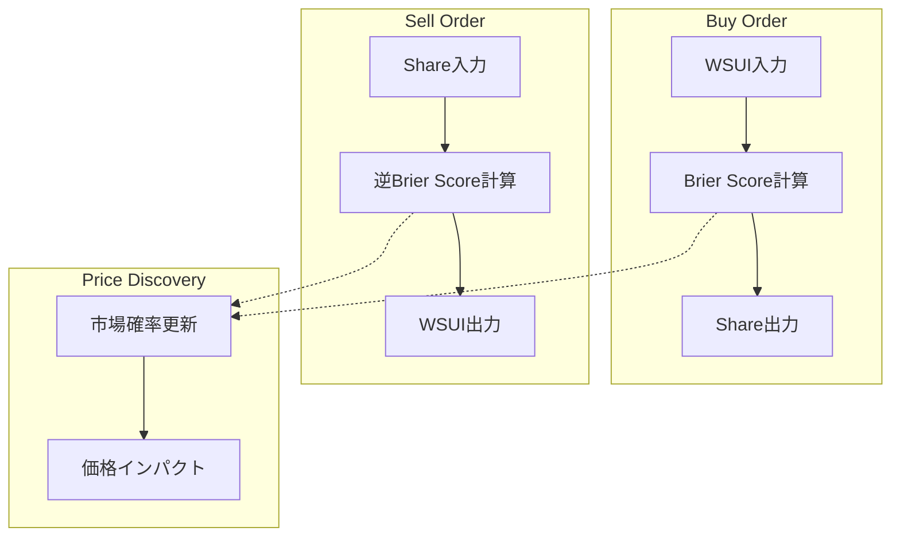

# 決定市場メカニズム

## 概要

決定市場（Decision Market）は、Daytimeフェーズにおける価格発見エンジンです。**Brier Score Dual SCPM**を採用し、真の確率を反映する数学的に厳密な価格形成を実現します。

## Brier Score理論

### **基本概念**
Brier Scoreは確率予測の精度を測定する指標で、決定市場において最適な価格メカニズムを提供します。

```
Brier Score = Σᵢ (pᵢ - oᵢ)²
where:
- pᵢ: 予測確率（市場価格）
- oᵢ: 実際の結果（0 or 1）
```

### **SCPM（Scoring Rule Probabilistic Market）**
```move
/// Brier Score実装における価格計算
public fun calculate_brier_score_price(
    current_shares: u64,
    total_shares: u128,
    num_outcomes: u64
): u64 {
    let prob_i = (current_shares as u128) / total_shares;
    let complementary_prob = (total_shares - (current_shares as u128)) / total_shares;

    // Brier Score微分による限界価格
    let marginal_price = 2 * prob_i * (1 - prob_i) / (num_outcomes as u128);
    (marginal_price as u64)
}
```

## 価格発見メカニズム

### **双方向価格計算**



### **Buy操作の実装**
```move
/// Share購入（WSUI → Share<T>）
public fun buy_shares<T>(
    market: &mut DecisionMarket,
    payment: Coin<WSUI>,
    clock: &Clock,
    ctx: &mut TxContext
): Coin<Share<T>> {
    // 1. 時間制限確認
    assert!(is_market_active(market, clock), E_MARKET_CLOSED);

    // 2. 現在の市場状態取得
    let vault = &mut market.vault;
    let current_shares = battle_vault::get_share_supply<T>(vault);
    let wsui_amount = payment.value();

    // 3. Brier Score価格計算
    let shares_to_mint = calculate_brier_score_swap(
        current_shares,
        vault.total_shares,
        wsui_amount,
        vault.num_outcomes
    );

    // 4. 状態更新
    battle_vault::deposit_wsui(vault, payment);
    let new_shares = battle_vault::mint_shares<T>(vault, shares_to_mint, ctx);
    vault.total_shares = vault.total_shares + (shares_to_mint as u128);

    coin::from_balance(new_shares, ctx)
}
```

### **Sell操作の実装**
```move
/// Share売却（Share<T> → WSUI）
public fun sell_shares<T>(
    market: &mut DecisionMarket,
    shares: Coin<Share<T>>,
    clock: &Clock,
    ctx: &mut TxContext
): Coin<WSUI> {
    // 1. 時間制限確認
    assert!(is_market_active(market, clock), E_MARKET_CLOSED);

    // 2. 現在の市場状態取得
    let vault = &mut market.vault;
    let current_shares = battle_vault::get_share_supply<T>(vault);
    let share_amount = shares.value();

    // 3. 逆Brier Score計算
    let wsui_payout = calculate_brier_score_sell(
        share_amount,
        current_shares,
        vault.total_shares,
        vault.num_outcomes
    );

    // 4. 状態更新
    let burned_shares = shares.into_balance();
    battle_vault::burn_shares<T>(vault, burned_shares);
    vault.total_shares = vault.total_shares - (share_amount as u128);

    let wsui_balance = battle_vault::withdraw_wsui(vault, wsui_payout, ctx);
    coin::from_balance(wsui_balance, ctx)
}
```

## 数学的詳細

### **Brier Score Swap計算**
```move
/// 投入WSUIから得られるShare数の計算
public fun calculate_brier_score_swap(
    current_shares: u64,
    total_shares: u128,
    wsui_input: u64,
    num_outcomes: u64
): u64 {
    let current_prob = if (total_shares == 0) {
        // 初期状態: 均等確率
        FIXED_POINT_SCALE / (num_outcomes as u128)
    } else {
        (current_shares as u128) * FIXED_POINT_SCALE / total_shares
    };

    // 新しい総投資額
    let new_total_wsui = get_total_wsui_value() + (wsui_input as u128);

    // 目標確率の逆算（Brier Score最適化）
    let optimal_prob = solve_brier_score_optimization(
        current_prob,
        wsui_input,
        new_total_wsui,
        num_outcomes
    );

    // 必要なShare数の計算
    let target_shares = (optimal_prob * new_total_wsui) / FIXED_POINT_SCALE;
    let shares_to_mint = target_shares - (current_shares as u128);

    (shares_to_mint as u64)
}
```

### **最適化アルゴリズム**
```move
/// Brier Score最適化による目標確率計算
fun solve_brier_score_optimization(
    current_prob: u128,
    investment: u64,
    total_investment: u128,
    num_outcomes: u64
): u128 {
    // Newton-Raphson法による数値解法
    let mut prob = current_prob;
    let mut iteration = 0;

    while (iteration < MAX_ITERATIONS) {
        // f(p) = Brier Score gradient
        let f_val = brier_score_gradient(prob, investment, total_investment, num_outcomes);

        // f'(p) = Brier Score second derivative
        let df_val = brier_score_second_derivative(prob, num_outcomes);

        // Newton-Raphson update
        let delta = (f_val * FIXED_POINT_SCALE) / df_val;

        if (delta < CONVERGENCE_THRESHOLD) break;

        prob = if (delta > prob) {
            prob / 2 // 収束保証のための制限
        } else {
            prob - delta
        };

        iteration = iteration + 1;
    };

    prob
}
```

## 価格インパクト分析

### **線形インパクト（小額取引）**
```
price_impact ≈ 2 × investment_ratio × current_probability
```

### **非線形インパクト（大額取引）**
```move
/// 大額取引における価格インパクト計算
public fun calculate_price_impact(
    investment_amount: u64,
    current_shares: u64,
    total_wsui: u64,
    num_outcomes: u64
): (u64, u64) { // (new_price, impact_percentage)
    let investment_ratio = (investment_amount as u128) * FIXED_POINT_SCALE / (total_wsui as u128);
    let current_prob = (current_shares as u128) * FIXED_POINT_SCALE / (total_wsui as u128);

    // 二次インパクト近似
    let linear_impact = 2 * investment_ratio * current_prob / FIXED_POINT_SCALE;
    let quadratic_impact = investment_ratio * investment_ratio / FIXED_POINT_SCALE;

    let total_impact = linear_impact + quadratic_impact;
    let new_price = current_prob + total_impact;

    // 確率制約（0 ≤ p ≤ 1）
    if (new_price > FIXED_POINT_SCALE) {
        new_price = FIXED_POINT_SCALE;
    };

    let impact_percentage = (total_impact * 100) / current_prob;
    ((new_price as u64), (impact_percentage as u64))
}
```

## 操作耐性メカニズム

### **フロントランニング防止**
```move
/// 最大スリッページ保護
public fun buy_shares_with_slippage<T>(
    market: &mut DecisionMarket,
    payment: Coin<WSUI>,
    min_shares_expected: u64,
    clock: &Clock,
    ctx: &mut TxContext
): Coin<Share<T>> {
    // 事前価格計算
    let expected_shares = calculate_brier_score_swap(
        battle_vault::get_share_supply<T>(&market.vault),
        market.vault.total_shares,
        payment.value(),
        market.vault.num_outcomes
    );

    // スリッページ確認
    assert!(expected_shares >= min_shares_expected, E_EXCESSIVE_SLIPPAGE);

    // 通常のbuy_shares実行
    buy_shares<T>(market, payment, clock, ctx)
}
```

### **Price Oracle統合**
```move
/// 外部価格との整合性確認
public fun validate_market_price<T>(
    market: &DecisionMarket,
    oracle_price: u64,
    tolerance_bp: u64 // basis points
): bool {
    let market_price = get_current_price<T>(market);
    let price_diff = if (market_price > oracle_price) {
        market_price - oracle_price
    } else {
        oracle_price - market_price
    };

    let tolerance = (oracle_price * tolerance_bp) / 10000;
    price_diff <= tolerance
}
```

## 流動性管理

### **Deep Liquidity保証**
```move
/// 流動性深度の計算
public fun calculate_liquidity_depth<T>(
    market: &DecisionMarket,
    price_range_bp: u64 // basis points
): (u64, u64) { // (buy_depth, sell_depth)
    let current_price = get_current_price<T>(market);
    let price_delta = (current_price * price_range_bp) / 10000;

    let upper_price = current_price + price_delta;
    let lower_price = if (current_price > price_delta) {
        current_price - price_delta
    } else { 0 };

    let buy_depth = calculate_wsui_for_price_target<T>(market, upper_price);
    let sell_depth = calculate_shares_for_price_target<T>(market, lower_price);

    (buy_depth, sell_depth)
}
```

### **流動性インセンティブ**
```move
/// 流動性提供者への報酬計算
public fun calculate_liquidity_reward(
    market: &DecisionMarket,
    provider: address,
    time_period_ms: u64
): u64 {
    let total_volume = get_total_volume(market, time_period_ms);
    let provider_contribution = get_provider_volume(market, provider, time_period_ms);

    let base_reward = (total_volume * LIQUIDITY_REWARD_RATE) / 10000;
    let provider_reward = (base_reward * provider_contribution) / total_volume;

    provider_reward
}
```

## ガス効率化

### **バッチ取引**
```move
/// 複数Share一括購入
public fun batch_buy_shares(
    market: &mut DecisionMarket,
    orders: vector<BuyOrder>,
    clock: &Clock,
    ctx: &mut TxContext
): vector<Coin<Share<T>>> {
    let mut results = vector[];
    let mut i = 0;

    while (i < orders.length()) {
        let order = &orders[i];
        let shares = buy_shares_internal<T>(
            market,
            order.wsui_amount,
            order.coin_type,
            clock,
            ctx
        );
        results.push_back(shares);
        i = i + 1;
    };

    results
}
```

### **状態キャッシング**
```move
/// 計算結果のキャッシュ
public struct PriceCache has store {
    last_update_ms: u64,
    cached_prices: Table<TypeName, u64>,
    cache_duration_ms: u64,
}

public fun get_cached_price<T>(
    cache: &mut PriceCache,
    market: &DecisionMarket,
    clock: &Clock
): u64 {
    let current_time = clock::timestamp_ms(clock);
    let cache_key = type_name::get<T>();

    if (current_time - cache.last_update_ms < cache.cache_duration_ms) {
        if (cache.cached_prices.contains(cache_key)) {
            return *cache.cached_prices.borrow(cache_key)
        }
    };

    // キャッシュミス: 再計算
    let fresh_price = calculate_current_price<T>(market);
    cache.cached_prices.add(cache_key, fresh_price);
    cache.last_update_ms = current_time;

    fresh_price
}
```

## イベント記録

### **取引ログ**
```move
/// 取引完了イベント
public struct TradeExecuted<phantom T> has copy, drop {
    trader: address,
    trade_type: u8, // 0=buy, 1=sell
    wsui_amount: u64,
    share_amount: u64,
    price: u64,
    timestamp: u64,
    market_id: ID,
}

/// 価格更新イベント
public struct PriceUpdated<phantom T> has copy, drop {
    coin_type: TypeName,
    old_price: u64,
    new_price: u64,
    price_impact: u64,
    total_shares: u128,
    timestamp: u64,
}
```

---

**次**: [暗号化バッチオークション](./07-sealed-batch-auction.md)
