# 暗号化バッチオークション（Sealed Batch Auction）

## 概要

Sealed Batch Auction（SBA）は、DarkNightフェーズにおけるMEV耐性取引システムです。**Time-Locked Encryption（TLE）**を活用し、完全な情報対称性を保証する革新的なオークション機構を実現します。

## 設計原理

### **MEV問題の解決**
従来のAMM/DEXでは以下の問題が存在します：
- **フロントランニング**: 取引を先回りして利益を得る
- **サンドイッチ攻撃**: 大口取引を挟み撃ちして価格操作
- **Priority Gas Auction**: ガス代競争による非効率性

### **TLE（Time-Locked Encryption）による解決**
```
暗号化フェーズ: 注文内容を秘匿
          ↓
実行フェーズ: 時間経過で自動復号
          ↓
清算フェーズ: 全注文を一括実行
```

## TLE暗号化メカニズム

### **時間ベース暗号化**
```move
/// TLE暗号化関数
public fun encrypt_order_with_tle(
    coin_type: TypeName,
    wsui_amount: u64,
    unlock_time_ms: u64,
    sender_key: vector<u8>,
    ctx: &mut TxContext
): vector<u8> {
    // 注文データのシリアライズ
    let order_data = serialize_order_data(coin_type, wsui_amount, sender_key);

    // TLE暗号化（Sui Sealベース）
    let encrypted_data = sui_seal::time_lock_encrypt(
        order_data,
        unlock_time_ms,
        ctx
    );

    encrypted_data
}
```

### **自動復号機構**
```move
/// 時間到達時の自動復号
public fun decrypt_order_at_time(
    encrypted_order: &SealedOrder,
    current_time_ms: u64
): Option<OrderData> {
    if (current_time_ms < encrypted_order.unlock_time) {
        return option::none()
    };

    // TLE復号実行
    let decrypted_bytes = sui_seal::time_lock_decrypt(
        encrypted_order.encrypted_data,
        current_time_ms
    );

    match (decrypted_bytes) {
        Some(data) => {
            let order_data = deserialize_order_data(data);
            option::some(order_data)
        },
        None => option::none()
    }
}
```

## バッチオークション構造

### **5バッチシステム**

```mermaid
gantt
    title DarkNight Phase (60分)
    dateFormat X
    axisFormat %M分

    section Batch 1
    受付    :0, 12
    実行    :12, 13

    section Batch 2
    受付    :12, 24
    実行    :24, 25

    section Batch 3
    受付    :24, 36
    実行    :36, 37

    section Batch 4
    受付    :36, 48
    実行    :48, 49

    section Batch 5
    受付    :48, 60
    実行    :60, 61
```


### **バッチ制御構造**
```move
/// 単一バッチの管理
public struct TradingBatch has key {
    id: UID,
    /// 所属DarkPool
    darkpool_id: ID,
    /// バッチ番号（1-5）
    batch_index: u8,
    /// 受付開始時刻
    start_time_ms: u64,
    /// 受付終了時刻
    end_time_ms: u64,
    /// ユーザー別封印注文
    sealed_orders: Table<address, vector<SealedOrder>>,
    /// 実行完了フラグ
    is_executed: bool,
    /// 総注文数
    total_orders: u64,
}

/// 封印注文データ
public struct SealedOrder has store {
    /// TLE暗号化データ
    encrypted_data: vector<u8>,
    /// 注文者アドレス
    sender: address,
    /// 提出時刻
    submit_time_ms: u64,
    /// 復号可能時刻
    unlock_time_ms: u64,
    /// 注文ハッシュ（検証用）
    order_hash: vector<u8>,
}
```

## 注文提出プロセス

### **注文暗号化**
```move
/// クライアント側の注文作成
public fun create_sealed_order<T>(
    wsui_amount: u64,
    batch_end_time: u64,
    user_secret: vector<u8>,
    ctx: &mut TxContext
): (vector<u8>, vector<u8>) { // (encrypted_data, proof)
    // 1. 注文データ構築
    let order_data = OrderData {
        coin_type: type_name::get<T>(),
        wsui_amount,
        sender: tx_context::sender(ctx),
        nonce: generate_nonce(ctx),
    };

    // 2. データハッシュ生成
    let order_hash = hash::sha3_256(bcs::to_bytes(&order_data));

    // 3. TLE暗号化
    let encrypted_data = encrypt_with_timelock(
        bcs::to_bytes(&order_data),
        batch_end_time,
        user_secret
    );

    // 4. Zero-Knowledge Proof生成（注文有効性証明）
    let validity_proof = generate_order_validity_proof(
        &order_data,
        &user_secret,
        ctx
    );

    (encrypted_data, validity_proof)
}
```

### **注文提出**
```move
/// DarkPoolへの注文提出
public fun submit_sealed_order(
    darkpool: &mut DarkPool,
    encrypted_data: vector<u8>,
    validity_proof: vector<u8>,
    ctx: &mut TxContext
): SealedOrderReceipt {
    let current_batch = darkpool.current_batch;
    assert!(current_batch <= 5, E_DARKNIGHT_COMPLETED);

    // 現在受付中のバッチ取得
    let batch_id = darkpool.batch_ids[current_batch - 1];
    let batch = borrow_mut_trading_batch(batch_id);

    // 時間制限確認
    let current_time = clock::timestamp_ms(&ctx.clock());
    assert!(current_time < batch.end_time_ms, E_BATCH_CLOSED);

    // 注文有効性検証
    assert!(verify_order_validity_proof(
        &encrypted_data,
        &validity_proof
    ), E_INVALID_ORDER_PROOF);

    // 注文記録
    let sender = tx_context::sender(ctx);
    let sealed_order = SealedOrder {
        encrypted_data,
        sender,
        submit_time_ms: current_time,
        unlock_time_ms: batch.end_time_ms,
        order_hash: hash::sha3_256(&encrypted_data),
    };

    // ユーザー注文リストに追加
    if (!batch.sealed_orders.contains(sender)) {
        batch.sealed_orders.add(sender, vector::empty());
    };
    let user_orders = batch.sealed_orders.borrow_mut(sender);
    user_orders.push_back(sealed_order);

    batch.total_orders = batch.total_orders + 1;

    // 確認書発行
    SealedOrderReceipt {
        id: object::new(ctx),
        batch_id: batch.id,
        order_hash: sealed_order.order_hash,
        submitter: sender,
    }
}
```

## バッチ実行メカニズム

### **一括復号・実行**
```move
/// バッチ終了時の一括実行
public fun execute_trading_batch(
    darkpool: &mut DarkPool,
    batch_index: u8,
    clock: &Clock,
    ctx: &mut TxContext
): BatchExecutionResult {
    let batch_id = darkpool.batch_ids[batch_index - 1];
    let batch = borrow_mut_trading_batch(batch_id);

    // 実行条件確認
    let current_time = clock::timestamp_ms(clock);
    assert!(current_time >= batch.end_time_ms, E_BATCH_NOT_ENDED);
    assert!(!batch.is_executed, E_ALREADY_EXECUTED);

    // 全注文の復号・実行
    let execution_results = vector::empty();
    let addresses = batch.sealed_orders.keys();

    let i = 0;
    while (i < addresses.length()) {
        let user_address = addresses[i];
        let user_orders = batch.sealed_orders.borrow(&user_address);

        let j = 0;
        while (j < user_orders.length()) {
            let sealed_order = &user_orders[j];

            // TLE復号
            let decrypted_result = decrypt_order_at_time(
                sealed_order,
                current_time
            );

            match (decrypted_result) {
                Some(order_data) => {
                    // 固定レート取引実行
                    let execution_result = execute_fixed_rate_trade(
                        darkpool,
                        &order_data,
                        ctx
                    );
                    execution_results.push_back(execution_result);
                },
                None => {
                    // 復号失敗: ログ記録のみ
                    emit_decryption_failed_event(sealed_order);
                }
            };

            j = j + 1;
        };
        i = i + 1;
    };

    batch.is_executed = true;

    BatchExecutionResult {
        batch_index,
        total_orders: batch.total_orders,
        successful_executions: execution_results.length(),
        execution_results,
    }
}
```

### **固定レート取引**
```move
/// 固定レートでのShare発行
fun execute_fixed_rate_trade(
    darkpool: &mut DarkPool,
    order_data: &OrderData,
    ctx: &mut TxContext
): TradeExecutionResult {
    let vault = &mut darkpool.vault;

    // 固定レート計算（DarkNight開始時に確定）
    let shares_to_mint = order_data.wsui_amount / darkpool.wsui_per_share;

    // Share発行
    let new_shares = match (order_data.coin_type) {
        coin_type if (is_finalist_coin(darkpool, coin_type)) => {
            // Finalist 8のみ取引可能
            let shares = battle_vault::mint_shares_by_type(
                vault,
                coin_type,
                shares_to_mint,
                ctx
            );
            option::some(shares)
        },
        _ => {
            // 非対象コイン: 取引拒否
            option::none()
        }
    };

    match (new_shares) {
        Some(shares) => {
            // WSUI預入
            let wsui_payment = coin::mint_for_testing<WSUI>(
                order_data.wsui_amount,
                ctx
            );
            battle_vault::deposit_wsui(vault, wsui_payment);

            // Share配布（ユーザーアカウントへ）
            transfer::public_transfer(shares, order_data.sender);

            TradeExecutionResult {
                success: true,
                user: order_data.sender,
                coin_type: order_data.coin_type,
                wsui_amount: order_data.wsui_amount,
                shares_received: shares_to_mint,
                execution_price: darkpool.wsui_per_share,
            }
        },
        None => {
            TradeExecutionResult {
                success: false,
                user: order_data.sender,
                coin_type: order_data.coin_type,
                wsui_amount: 0,
                shares_received: 0,
                execution_price: 0,
            }
        }
    }
}
```

## MEV保護機構

### **順序独立性**
```move
/// 注文実行順序のランダム化
public fun randomize_execution_order(
    orders: &vector<SealedOrder>,
    batch_end_time: u64
): vector<u64> { // execution indices
    // バッチ終了時刻をシードとしたランダム化
    let seed = batch_end_time;
    let mut indices = vector::empty();
    let mut i = 0;

    while (i < orders.length()) {
        indices.push_back(i);
        i = i + 1;
    };

    // Fisher-Yates shuffle
    i = indices.length() - 1;
    while (i > 0) {
        let random_seed = hash::sha3_256(bcs::to_bytes(&seed + (i as u64)));
        let j = bytes_to_u64(random_seed) % (i + 1);

        // swap(indices[i], indices[j])
        let temp = indices[i];
        indices[i] = indices[j];
        indices[j] = temp;

        i = i - 1;
    };

    indices
}
```

### **価格操作防止**
```move
/// 大口注文の分散実行
public fun split_large_orders(
    orders: &vector<OrderData>,
    max_order_size: u64
): vector<OrderData> {
    let mut split_orders = vector::empty();

    let i = 0;
    while (i < orders.length()) {
        let order = &orders[i];

        if (order.wsui_amount <= max_order_size) {
            split_orders.push_back(*order);
        } else {
            // 大口注文を分割
            let num_splits = (order.wsui_amount + max_order_size - 1) / max_order_size;
            let split_amount = order.wsui_amount / num_splits;

            let j = 0;
            while (j < num_splits) {
                let amount = if (j == num_splits - 1) {
                    // 最後の分割: 余りを調整
                    order.wsui_amount - (split_amount * j)
                } else {
                    split_amount
                };

                let split_order = OrderData {
                    coin_type: order.coin_type,
                    wsui_amount: amount,
                    sender: order.sender,
                    nonce: order.nonce + (j as u64),
                };

                split_orders.push_back(split_order);
                j = j + 1;
            };
        };

        i = i + 1;
    };

    split_orders
}
```

## ガス効率化

### **バッチ最適化**
```move
/// ガス効率的なバッチ実行
public fun gas_optimized_batch_execution(
    darkpool: &mut DarkPool,
    batch_index: u8,
    max_gas_budget: u64,
    clock: &Clock,
    ctx: &mut TxContext
): PartialExecutionResult {
    let estimated_gas_per_order = ESTIMATED_GAS_PER_ORDER;
    let max_orders = max_gas_budget / estimated_gas_per_order;

    let batch_id = darkpool.batch_ids[batch_index - 1];
    let batch = borrow_mut_trading_batch(batch_id);

    // 実行優先度による注文ソート
    let prioritized_orders = prioritize_orders(batch);
    let orders_to_execute = if (prioritized_orders.length() > max_orders) {
        vector::slice(&prioritized_orders, 0, max_orders)
    } else {
        prioritized_orders
    };

    // 部分実行
    let execution_results = execute_orders_subset(
        darkpool,
        &orders_to_execute,
        ctx
    );

    PartialExecutionResult {
        executed_count: orders_to_execute.length(),
        remaining_count: batch.total_orders - orders_to_execute.length(),
        results: execution_results,
        needs_continuation: orders_to_execute.length() < batch.total_orders,
    }
}
```

### **継続実行機構**
```move
/// ガス制限による継続実行
public fun continue_batch_execution(
    darkpool: &mut DarkPool,
    batch_index: u8,
    continuation_state: &ExecutionState,
    max_gas_budget: u64,
    ctx: &mut TxContext
): PartialExecutionResult {
    // 前回の実行位置から継続
    let remaining_orders = get_remaining_orders(batch_index, continuation_state);

    // ガス制限内での最大実行
    gas_optimized_batch_execution(
        darkpool,
        batch_index,
        max_gas_budget,
        ctx
    )
}
```

## 監査性とログ

### **完全な実行ログ**
```move
/// バッチ実行完了イベント
public struct BatchExecuted has copy, drop {
    darkpool_id: ID,
    batch_index: u8,
    execution_time_ms: u64,
    total_orders: u64,
    successful_executions: u64,
    total_wsui_traded: u64,
    gas_consumed: u64,
}

/// 個別注文実行イベント
public struct OrderExecuted has copy, drop {
    batch_index: u8,
    order_hash: vector<u8>,
    sender: address,
    coin_type: TypeName,
    wsui_amount: u64,
    shares_received: u64,
    execution_timestamp: u64,
}
```

### **透明性保証**
```move
/// 暗号化前注文データの公開（実行後）
public fun reveal_order_data(
    receipt: &SealedOrderReceipt,
    decryption_key: vector<u8>
): OrderData {
    // TLE復号後に注文内容を公開
    // これにより取引の透明性を事後的に保証
}
```

---

**次**: [決済エンジン](./08-settlement-engine.md)
