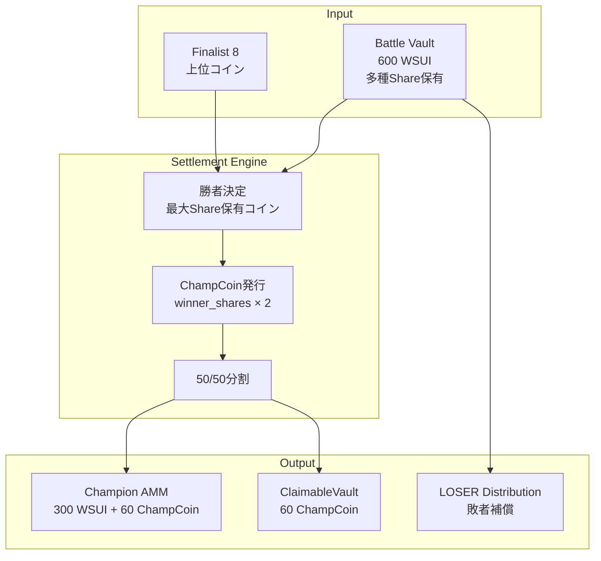

# 決済エンジン（Settlement Engine）

## 概要

Settlement Engineは、DarkNight終了後の勝者確定と価値分配を担う中核システムです。**原子的決済処理**により、全参加者への公平な価値配分を瞬時に実行します。

## 決済プロセス概要

### **Settlement フェーズの目的**
1. **勝者確定**: Finalist 8から最終勝者を決定
2. **ChampCoin発行**: 勝者Share→ChampCoinの変換
3. **価値分配**: 50% AMM流動性、50% 直接請求可能
4. **敗者補償**: LOSER Token配布



## 勝者決定アルゴリズム

### **最大Share保有者方式**
```move
/// 勝者コインの決定
public fun determine_winner(
    vault: &BattleVault,
    finalist_coins: &vector<TypeName>
): TypeName {
    assert!(finalist_coins.length() == 8, E_INVALID_FINALIST_COUNT);

    let mut max_shares = 0u64;
    let mut winner_type = finalist_coins[0];

    let i = 0;
    while (i < finalist_coins.length()) {
        let coin_type = finalist_coins[i];
        let share_supply = battle_vault::get_share_supply_by_type(vault, coin_type);

        if (share_supply > max_shares) {
            max_shares = share_supply;
            winner_type = coin_type;
        };

        i = i + 1;
    };

    // 勝者確定のログ出力
    emit_winner_determined_event(winner_type, max_shares);

    winner_type
}
```

### **タイブレーカー処理**
```move
/// 同票時の決定ルール
fun resolve_tie(
    tied_coins: &vector<TypeName>,
    vault: &BattleVault
): TypeName {
    // 1. 最新取引時刻が早い方
    // 2. 型名の辞書順

    let mut earliest_trade_time = u64::MAX;
    let mut winner_candidate = tied_coins[0];

    let i = 0;
    while (i < tied_coins.length()) {
        let coin_type = tied_coins[i];
        let last_trade_time = get_last_trade_time(vault, coin_type);

        if (last_trade_time < earliest_trade_time) {
            earliest_trade_time = last_trade_time;
            winner_candidate = coin_type;
        } else if (last_trade_time == earliest_trade_time) {
            // 辞書順で決定
            if (type_name_less_than(coin_type, winner_candidate)) {
                winner_candidate = coin_type;
            };
        };

        i = i + 1;
    };

    winner_candidate
}
```

## ChampCoin発行メカニズム

### **2倍発行ルール**
```move
/// ChampCoin発行（winner_shares × 2）
public fun mint_champ_coins<T>(
    winner_shares: u64,
    round_number: u64,
    ctx: &mut TxContext
): (Balance<ChampCoin<T>>, Balance<ChampCoin<T>>) {
    // 総発行量 = 勝者Share数の2倍
    let total_supply = winner_shares * 2;

    // ChampCoin供給管理作成
    let champ_supply = balance::create_supply(ChampCoin<T> {});

    // 50/50分割発行
    let amm_allocation = total_supply / 2;
    let claimable_allocation = total_supply - amm_allocation;

    let amm_balance = champ_supply.increase_supply(amm_allocation);
    let claimable_balance = champ_supply.increase_supply(claimable_allocation);

    // 供給管理をグローバルに保存
    let champ_supply_obj = ChampCoinSupply {
        id: object::new(ctx),
        original_coin_type: type_name::get<T>(),
        round_number,
        supply: champ_supply,
        total_supply,
    };
    transfer::share_object(champ_supply_obj);

    (amm_balance, claimable_balance)
}
```

### **ChampCoin構造**
```move
/// チャンピオンコイン型定義
public struct ChampCoin<phantom T> has store {}

/// 供給管理
public struct ChampCoinSupply<phantom T> has key {
    id: UID,
    /// 元のコインタイプ
    original_coin_type: TypeName,
    /// 発行ラウンド
    round_number: u64,
    /// 供給制御
    supply: Supply<ChampCoin<T>>,
    /// 総発行量
    total_supply: u64,
}
```

## 価値分配システム

### **Champion AMM作成**
```move
/// Champions Market（50%分）の作成
public fun create_champions_market<T>(
    wsui_reserve: Balance<WSUI>,
    champ_coins: Balance<ChampCoin<T>>,
    ctx: &mut TxContext
): ChampionsMarket<T> {
    let wsui_amount = wsui_reserve.value();
    let champ_amount = champ_coins.value();

    // 初期価格 = total_wsui / winner_shares
    let initial_price = wsui_amount / champ_amount;

    ChampionsMarket {
        id: object::new(ctx),
        wsui_reserve,
        champ_reserve: champ_coins,
        initial_price,
        total_volume: 0,
        fee_rate: 30, // 0.3%
        created_at: tx_context::epoch(ctx),
    }
}
```

### **ClaimableVault作成**
```move
/// 請求可能金庫（50%分）の作成
public fun create_claimable_vault<T>(
    round_number: u64,
    champ_coins: Balance<ChampCoin<T>>,
    battle_vault: &BattleVault,
    winner_type: TypeName,
    ctx: &mut TxContext
): ClaimableVault<T> {
    // 勝者Share保有者の請求権計算
    let claim_rights = calculate_claim_rights<T>(battle_vault, winner_type);

    ClaimableVault {
        id: object::new(ctx),
        round_number,
        champ_balance: champ_coins,
        claim_rights,
        claimed_records: table::new(ctx),
        total_claimable: champ_coins.value(),
    }
}

/// 請求権の計算
fun calculate_claim_rights<T>(
    vault: &BattleVault,
    winner_type: TypeName
): Table<address, u64> {
    // 実装では全Share保有者の残高を検索
    // 簡略化バージョン
    let claim_rights = table::new();

    // 注意: 実際の実装では、Share保有者の追跡が必要
    // これはShare転送イベントの履歴から構築される

    claim_rights
}
```

## LOSER Token配布

### **配布計算**
```move
/// LOSER Token配布実行
public fun distribute_loser_tokens(
    vault: &BattleVault,
    winner_type: TypeName,
    distribution_rate: u64,
    round_number: u64,
    ctx: &mut TxContext
): LOSERDistribution {
    let total_wsui = battle_vault::get_wsui_reserve(vault);
    let winner_shares = battle_vault::get_share_supply_by_type(vault, winner_type);

    // 敗者投資額計算
    let winner_wsui_equivalent = (winner_shares as u64) * total_wsui /
        (vault.total_shares as u64);
    let loser_wsui_total = total_wsui - winner_wsui_equivalent;

    // LOSER配布量計算（逓減レート）
    let current_rate = calculate_current_loser_rate(round_number);
    let total_loser_distribution = loser_wsui_total * current_rate;

    // 敗者リストと配布額の計算
    let loser_distributions = calculate_individual_distributions(
        vault,
        winner_type,
        total_loser_distribution
    );

    LOSERDistribution {
        id: object::new(ctx),
        round_number,
        winner_coin_type: winner_type,
        total_wsui_lost: loser_wsui_total,
        total_loser_distributed: total_loser_distribution,
        distribution_rate: current_rate,
        individual_distributions: loser_distributions,
    }
}
```

### **逓減レート計算**
```move
/// LOSER配布レートの計算（ラウンド数に応じて逓減）
public fun calculate_current_loser_rate(round_number: u64): u64 {
    const INITIAL_RATE: u64 = 100_000; // 100 LOSER per 1 WSUI
    const FINAL_RATE: u64 = 1_000;     // 1 LOSER per 1 WSUI
    const TOTAL_ROUNDS: u64 = 100;     // 100ラウンドで最小値

    if (round_number >= TOTAL_ROUNDS) {
        return FINAL_RATE
    };

    let rate_decrease = (INITIAL_RATE - FINAL_RATE) * round_number / TOTAL_ROUNDS;
    INITIAL_RATE - rate_decrease
}
```

## 原子的決済実行

### **全体統合フロー**
```move
/// Settlement全体の原子的実行
public fun execute_atomic_settlement<T>(
    engine: &mut SettlementEngine,
    vault: BattleVault,
    finalist_coins: vector<TypeName>,
    ctx: &mut TxContext
): SettlementResult<T> {
    assert!(!engine.is_settled, E_ALREADY_SETTLED);

    // 1. 勝者決定
    let winner_type = determine_winner(&vault, &finalist_coins);
    engine.winner_coin_type = option::some(winner_type);

    // 2. 勝者Share数取得
    let winner_shares = battle_vault::get_share_supply_by_type(&vault, winner_type);

    // 3. ChampCoin発行
    let (amm_champ_coins, claimable_champ_coins) = mint_champ_coins<T>(
        winner_shares,
        engine.round_number,
        ctx
    );

    // 4. Battle Vault分解
    let (wsui_reserve, share_supplies, num_outcomes, total_shares, round_id) =
        battle_vault::transfer_contents(vault);

    // 5. Champion AMM作成
    let champions_market = create_champions_market<T>(
        wsui_reserve,
        amm_champ_coins,
        ctx
    );

    // 6. ClaimableVault作成
    let claimable_vault = create_claimable_vault<T>(
        engine.round_number,
        claimable_champ_coins,
        &reconstructed_vault, // 一時的再構築
        winner_type,
        ctx
    );

    // 7. LOSER配布
    let loser_distribution = distribute_loser_tokens(
        &reconstructed_vault,
        winner_type,
        engine.loser_distribution_rate,
        engine.round_number,
        ctx
    );

    engine.is_settled = true;

    SettlementResult {
        winner_coin_type: winner_type,
        champions_market,
        claimable_vault,
        loser_distribution,
        settlement_timestamp: tx_context::epoch_timestamp_ms(ctx),
    }
}
```

### **エラー処理と復旧**
```move
/// Settlement失敗時の安全な復旧
public fun safe_settlement_execution<T>(
    engine: &mut SettlementEngine,
    vault: BattleVault,
    finalist_coins: vector<TypeName>,
    ctx: &mut TxContext
): Result<SettlementResult<T>, BattleVault> {
    // チェックポイント作成
    let vault_checkpoint = create_vault_checkpoint(&vault);

    // Settlement試行
    let settlement_result = try_atomic_settlement<T>(
        engine,
        vault,
        finalist_coins,
        ctx
    );

    match (settlement_result) {
        Ok(result) => Ok(result),
        Err(error_code) => {
            // エラー時：元の状態に復元
            let restored_vault = restore_from_checkpoint(vault_checkpoint);
            Err(restored_vault)
        }
    }
}
```

## ChampCoin請求システム

### **請求権検証**
```move
/// ChampCoin請求実行
public fun claim_champ_coins<T>(
    claimable: &mut ClaimableVault<T>,
    winner_shares: Coin<Share<T>>,
    ctx: &mut TxContext
): Coin<ChampCoin<T>> {
    let claimer = tx_context::sender(ctx);
    let share_amount = winner_shares.value();

    // 重複請求チェック
    assert!(!claimable.claimed_records.contains(claimer), E_ALREADY_CLAIMED);

    // 請求権確認
    assert!(claimable.claim_rights.contains(claimer), E_NO_CLAIM_RIGHT);
    let claimable_amount = *claimable.claim_rights.borrow(claimer);
    assert!(share_amount <= claimable_amount, E_INSUFFICIENT_CLAIM_RIGHT);

    // 1:1変換実行
    let champ_coins = claimable.champ_balance.split(share_amount);

    // Share燃焼
    let share_balance = winner_shares.into_balance();
    balance::destroy_zero(share_balance); // 実際には燃焼処理

    // 請求記録
    claimable.claimed_records.add(claimer, true);
    claimable.claim_rights.remove(claimer);

    coin::from_balance(champ_coins, ctx)
}
```

### **バッチ請求**
```move
/// 複数ユーザーの一括請求処理
public fun batch_claim_processing<T>(
    claimable: &mut ClaimableVault<T>,
    claim_requests: vector<ClaimRequest<T>>,
    ctx: &mut TxContext
): vector<ClaimResult> {
    let mut results = vector::empty();

    let i = 0;
    while (i < claim_requests.length()) {
        let request = &claim_requests[i];

        let result = try_individual_claim<T>(
            claimable,
            request,
            ctx
        );

        results.push_back(result);
        i = i + 1;
    };

    results
}
```

## 監査性とイベント

### **決済ログ**
```move
/// Settlement完了イベント
public struct SettlementCompleted<phantom T> has copy, drop {
    round_number: u64,
    winner_coin_type: TypeName,
    winner_shares: u64,
    total_wsui_distributed: u64,
    champ_coins_minted: u64,
    loser_tokens_distributed: u64,
    settlement_timestamp: u64,
}

/// ChampCoin請求イベント
public struct ChampCoinClaimed<phantom T> has copy, drop {
    claimer: address,
    round_number: u64,
    share_amount: u64,
    champ_amount: u64,
    claim_timestamp: u64,
}
```

### **透明性保証**
```move
/// Settlement結果の公開検証
public fun verify_settlement_correctness<T>(
    settlement_result: &SettlementResult<T>,
    original_vault_state: &VaultSnapshot
): bool {
    // 1. 総価値保存の確認
    let total_value_before = original_vault_state.total_wsui;
    let total_value_after = settlement_result.champions_market.wsui_reserve.value() +
                           calculate_claimable_value(&settlement_result.claimable_vault);

    // 2. ChampCoin発行量の確認
    let expected_champ_supply = original_vault_state.winner_shares * 2;
    let actual_champ_supply = settlement_result.champions_market.champ_reserve.value() +
                              settlement_result.claimable_vault.total_claimable;

    // 3. LOSER配布の確認
    let expected_loser_amount = calculate_expected_loser_distribution(original_vault_state);
    let actual_loser_amount = settlement_result.loser_distribution.total_loser_distributed;

    total_value_before == total_value_after &&
    expected_champ_supply == actual_champ_supply &&
    expected_loser_amount == actual_loser_amount
}
```

---

**次**: [Champion AMM](./09-champion-amm.md)
