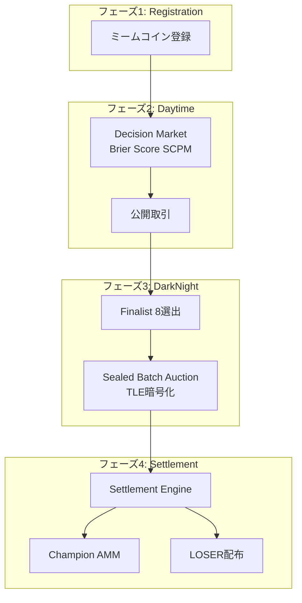

# BUMP.WIN アーキテクチャドキュメント

> 統一的パースペクティブによる整理されたアーキテクチャドキュメンテーション

## 概要

BUMP.WINは、ミームコインバトルロワイヤルプロトコルです。複数のミームコインが競争し、最後に残った勝者が全流動性を獲得する仕組みを、公平で透明な市場メカニズムで実現します。

## ドキュメント構成

### 📖 **システム概要**
- [01-system-overview.md](./01-system-overview.md) - 全体システム概要とビジョン
- [02-economic-model.md](./02-economic-model.md) - 経済モデルと価値フロー

### 🏗️ **コアアーキテクチャ**
- [03-core-data-structures.md](./03-core-data-structures.md) - 中核データ構造
- [04-phase-transitions.md](./04-phase-transitions.md) - フェーズ遷移システム
- [05-module-interfaces.md](./05-module-interfaces.md) - モジュール間インターフェース

### ⚙️ **技術詳細**
- [06-decision-market.md](./06-decision-market.md) - 決定市場メカニズム（Brier Score SCPM）
- [07-sealed-batch-auction.md](./07-sealed-batch-auction.md) - 暗号化バッチオークション（TLE）
- [08-settlement-engine.md](./08-settlement-engine.md) - 決済エンジンと清算システム
- [09-champion-amm.md](./09-champion-amm.md) - ChampionAMM（OBMM実装）

### 🔧 **実装ガイド**
- [10-move-implementation.md](./10-move-implementation.md) - Move実装仕様
- [11-deployment-guide.md](./11-deployment-guide.md) - デプロイメント手順

## 設計原則

### 1. **統一性（Unification）**
- 単一のアーキテクチャビジョンに基づく設計
- 一貫したデータフローとインターフェース
- Move言語制約との整合性

### 2. **透明性（Transparency）**
- 全ての操作がオンチェーンで検証可能
- 暗号学的公平性保証（TLE）
- オープンソース実装

### 3. **拡張性（Scalability）**
- モジュラー設計による機能拡張
- 効率的なガス使用
- 将来のアップグレード対応

## アーキテクチャ概要図

## 中核コンセプト

### **Battle Vault（バトル金庫）**
システムの中心データ構造。WSUI準備金とShare供給を管理し、フェーズ間を移管される。

### **Share<T>（シェアトークン）**
各ミームコインに対応する決定市場シェア。勝率に応じて価値が変動。

### **ChampCoin（チャンピオンコイン）**
勝者ミームコインの変換後トークン。AMM流動性とクレーム可能残高に分割。

### **LOSER Token（敗者トークン）**
敗者への補償トークン。プロトコル手数料のステーキング報酬付き。

## 開発状況

- ✅ **設計完了**: アーキテクチャ設計とドキュメント
- ⏳ **実装中**: Move モジュール実装
- 📋 **TODO**: テストとデプロイメント

---

**旧ドキュメント**: [old-docs/](../old-docs/) に移動済み
