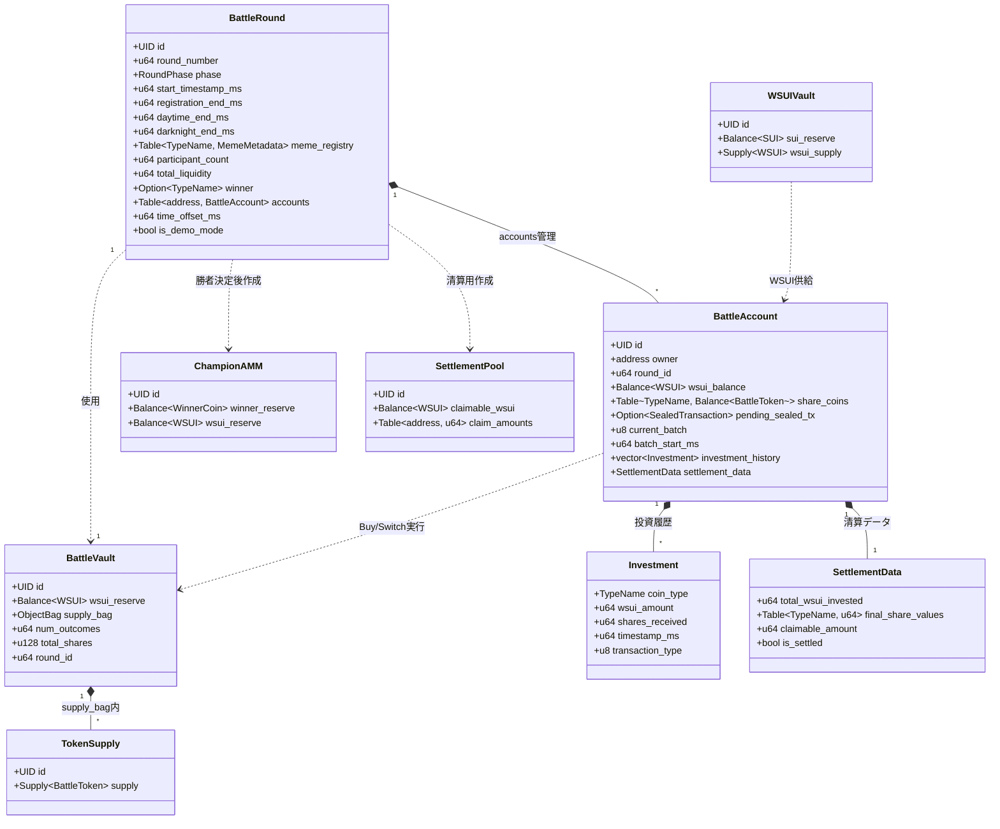
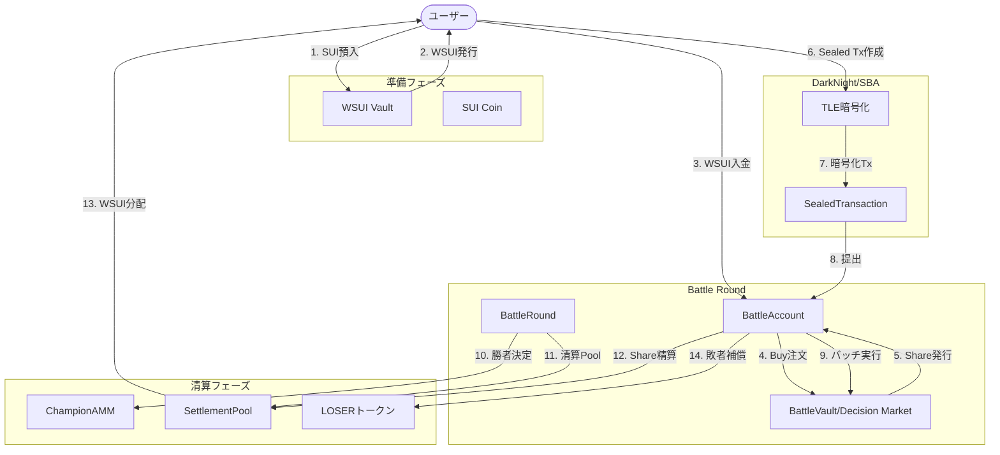

# BUMP.WIN アーキテクチャ構造図

## 主要構造体の関係

## データフロー図

## 時系列状態遷移

```mermaid
stateDiagram-v2
    [*] --> Registration: ラウンド開始

    Registration --> Daytime: 3日後
    state Registration {
        [*] --> MemeRegister
        MemeRegister --> CommunityBuild
        CommunityBuild --> InitialInvest
    }

    Daytime --> DarkNight: 24時間後
    state Daytime {
        [*] --> OpenTrading
        OpenTrading --> PriceDiscovery
        PriceDiscovery --> MarketMaking
    }

    DarkNight --> Settlement: 1時間後
    state DarkNight {
        [*] --> Batch1
        Batch1 --> Batch2: 12分
        Batch2 --> Batch3: 12分
        Batch3 --> Batch4: 12分
        Batch4 --> Batch5: 12分
        Batch5 --> [*]: 価格確定

        state Batch1 {
            WSUIDeposit --> SealedTxSubmit
            SealedTxSubmit --> TxReplace
            TxReplace --> BatchExecute
        }
    }

    Settlement --> Complete: 清算完了
    state Settlement {
        [*] --> WinnerDeclare
        WinnerDeclare --> CreateAMM
        CreateAMM --> DistributeRewards
        DistributeRewards --> IssueLOSER
    }

    Complete --> [*]
```

## 核心的な関係性

1. **BattleRound** が全体を統括
   - 複数の **BattleAccount** を管理
   - **BattleVault** (Decision Market) を参照

2. **BattleAccount** が個人資産を管理
   - WSUI残高（SBA期間のみ、全額消費必須）
   - Share実体（BattleTokenのBalance）
   - Sealed取引

3. **BattleVault** が市場メカニズムを実装
   - Brier Score価格計算
   - Share発行管理
   - WSUI準備金保持

4. **清算時の分離**
   - **ChampionAMM**: 勝者の50%流動性
   - **SettlementPool**: 残り50%の分配用
   - **LOSERトークン**: 敗者への補償
