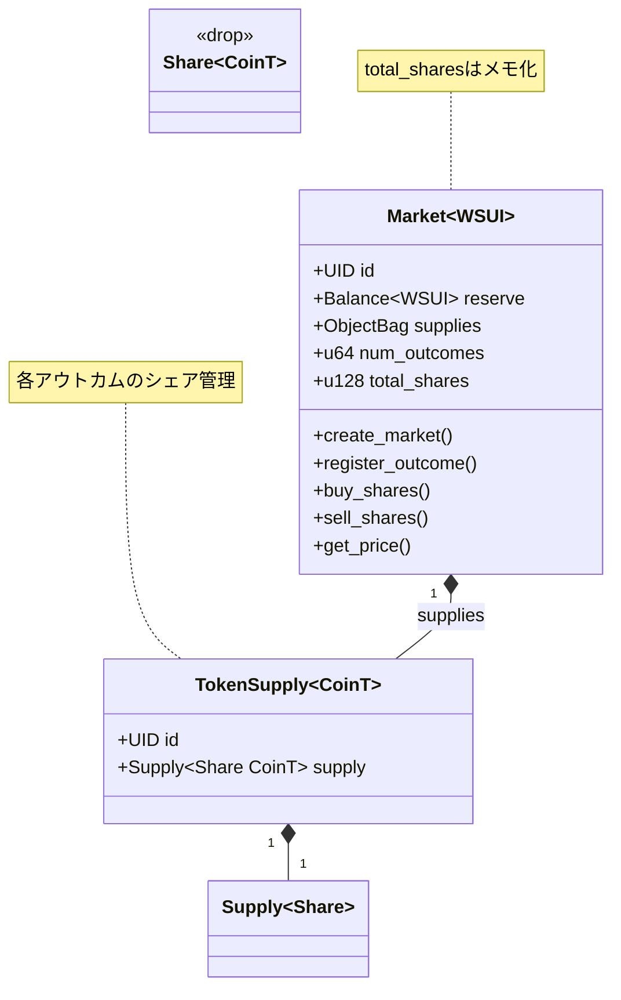
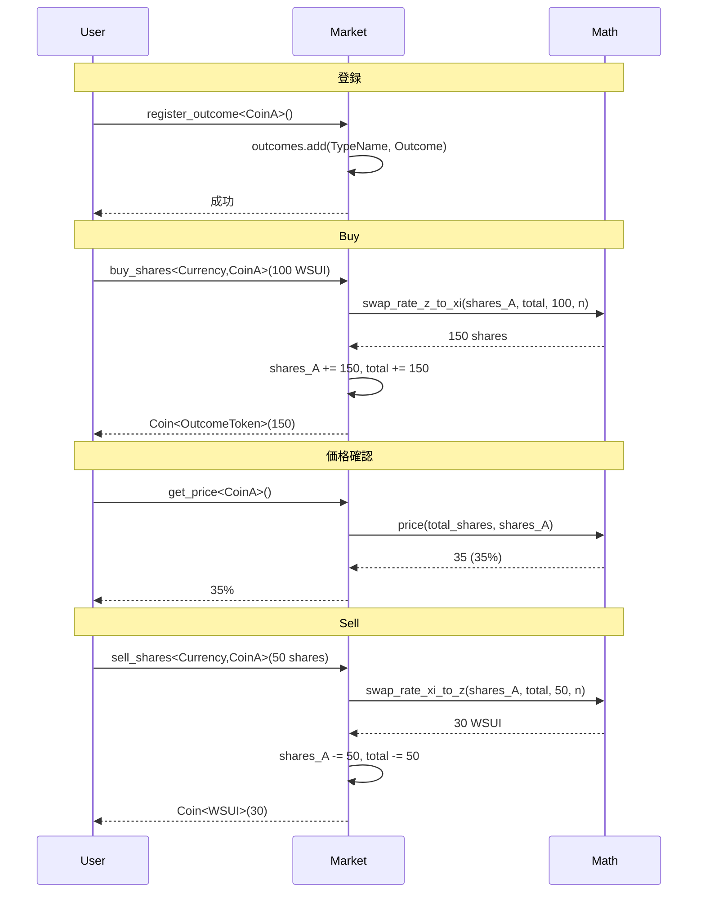

# Decision Market 設計

## Brier Score数学

```
コスト関数: C(x) = (1/4)∑xᵢ² - (1/4n)(∑xᵢ)² + (1/n)∑xᵢ
価格関数: pᵢ(x) = (1/8)(3xᵢ - ∑ⱼ≠ᵢ xⱼ) + 1/4

保証: ∑pᵢ(x) = 1（常に100%合計）
```

## Move アーキテクチャ



## 取引フロー



## 実装コード（Supplyベース）

```move
// 構造体定義
public struct Market has key, store {
    id: UID,
    reserve: Balance<WSUI>,
    supplies: ObjectBag,  // TypeName → TokenSupply<CoinT>
    num_outcomes: u64,
    total_shares: u128,  // メモ化された総シェア数
}

public struct TokenSupply<phantom CoinT> has store {
    id: UID,
    supply: Supply<Share<CoinT>>,
}

public struct Share<phantom CoinT> has drop {}

// アウトカム登録
public fun register_outcome<T>(
    market: &mut Market,
    ctx: &mut TxContext
) {
    let type_name = type_name::get<T>();
    assert!(!market.supplies.contains(type_name), E_OUTCOME_EXISTS);

    let token_supply = TokenSupply<T> {
        id: object::new(ctx),
        supply: balance::create_supply(Share<T> {}),
    };

    market.supplies.add(type_name, token_supply);
    market.num_outcomes = market.num_outcomes + 1;
}

// 購入（Supplyから正確なシェア数を取得）
public fun buy_shares<T>(
    market: &mut Market,
    payment: Coin<WSUI>,
    ctx: &mut TxContext
): Coin<Share<T>> {
    let payment_amount = payment.value();
    let type_name = type_name::get<T>();

    // 現在のシェア数をSupplyから取得
    let token_supply = market.supplies.borrow_mut<TypeName, TokenSupply<T>>(type_name);
    let current_shares = token_supply.supply.supply_value();

    // メモ化された総シェア数を使用
    let total_shares = market.total_shares;

    // Brier Score計算
    let shares_to_mint = market_math::swap_rate_z_to_xi(
        current_shares,
        total_shares,
        payment_amount,
        market.num_outcomes
    );

    // 準備金追加
    market.reserve.join(payment.into_balance());

    // シェア発行（Supplyで管理）
    let new_shares = token_supply.supply.increase_supply(shares_to_mint);

    // total_sharesを更新（メモ化）
    market.total_shares = market.total_shares + (shares_to_mint as u128);

    balance::into_coin(new_shares, ctx)
}

// 価格取得（メモ化されたtotal_sharesを使用）
public fun get_price<T>(market: &Market): u64 {
    let type_name = type_name::get<T>();
    let token_supply = market.supplies.borrow<TypeName, TokenSupply<T>>(type_name);
    let shares_of_t = token_supply.supply.supply_value();

    market_math::price(
        market.total_shares as u64,
        shares_of_t
    )
}
```
