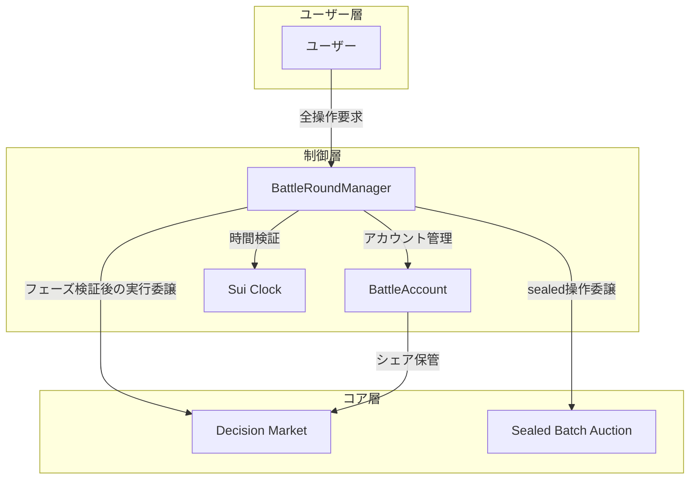
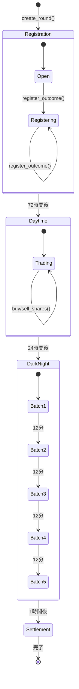

# BattleRoundManager 設計

## 概要

BattleRoundManagerは、Decision Marketへのアクセスを時間制御し、Battle Roundのライフサイクル全体を管理する制御層です。ユーザーは直接Decision Marketにアクセスできず、必ずBattleRoundManagerを経由します。

## アーキテクチャ



## 構造体定義

```move
public struct BattleRoundManager has key {
    id: UID,
    /// ラウンド番号
    round_number: u64,
    /// Decision Market参照
    market_id: ID,
    /// フェーズタイムスタンプ
    registration_end_ms: u64,
    daytime_end_ms: u64,
    darknight_end_ms: u64,
    /// アカウント管理
    accounts: Table<address, BattleAccount>,
    /// デモモード
    time_offset_ms: u64,
    is_demo_mode: bool,
}

public struct BattleAccount has store {
    id: UID,
    owner: address,
    /// WSUI残高（DarkNightのみ）
    wsui_balance: Balance<WSUI>,
    /// 保有シェア（Decision Marketから取得）
    share_balances: Table<TypeName, Balance<Share<CoinT>>>,
    /// SBA用
    pending_sealed_tx: Option<SealedTransaction>,
}
```

## フェーズ管理



## 時間ゲート関数

### 1. 登録フェーズ限定

```move
public fun register_outcome<T>(
    manager: &mut BattleRoundManager,
    market: &mut Market,
    clock: &Clock,
    ctx: &mut TxContext
) {
    // 時間検証
    let current_time = get_effective_time(manager, clock);
    assert!(current_time < manager.registration_end_ms, E_NOT_REGISTRATION_PHASE);

    // Decision Market呼び出し
    market.register_outcome<T>(ctx);
}
```

### 2. 取引フェーズ（Daytime + DarkNight）

```move
public fun buy_shares<T>(
    manager: &mut BattleRoundManager,
    market: &mut Market,
    payment: Coin<WSUI>,
    clock: &Clock,
    ctx: &mut TxContext
): Coin<Share<T>> {
    let current_time = get_effective_time(manager, clock);

    // Daytime または DarkNight のみ許可
    assert!(
        current_time >= manager.registration_end_ms &&
        current_time < manager.darknight_end_ms,
        E_TRADING_NOT_ALLOWED
    );

    // DarkNight特別処理
    if (current_time >= manager.daytime_end_ms) {
        // SBA経由での取引
        return process_sealed_buy<T>(manager, market, payment, clock, ctx);
    };

    // 通常取引
    market.buy_shares<T>(payment, ctx)
}

public fun sell_shares<T>(
    manager: &mut BattleRoundManager,
    market: &mut Market,
    shares: Coin<Share<T>>,
    clock: &Clock,
    ctx: &mut TxContext
): Coin<WSUI> {
    let current_time = get_effective_time(manager, clock);

    // Daytime のみ許可（DarkNightは売却不可）
    assert!(
        current_time >= manager.registration_end_ms &&
        current_time < manager.daytime_end_ms,
        E_SELL_NOT_ALLOWED
    );

    market.sell_shares<T>(shares, ctx)
}
```

### 3. 価格取得（常時可能）

```move
public fun get_price<T>(
    manager: &BattleRoundManager,
    market: &Market,
    clock: &Clock
): u64 {
    // 時間制限なし、参照のみ
    market.get_price<T>()
}
```

## DarkNight/SBA統合

```move
fun process_sealed_buy<T>(
    manager: &mut BattleRoundManager,
    market: &mut Market,
    payment: Coin<WSUI>,
    clock: &Clock,
    ctx: &mut TxContext
): Coin<Share<T>> {
    let sender = ctx.sender();
    let account = get_or_create_account(manager, sender, ctx);

    // WSUIをアカウントに入金
    account.wsui_balance.join(payment.into_balance());

    // Sealed Transaction作成
    let sealed_tx = create_sealed_buy_tx<T>(
        account.wsui_balance.value(),
        get_current_batch(manager, clock)
    );

    account.pending_sealed_tx = option::some(sealed_tx);

    // バッチ実行まで待機（実際のシェアは後で）
    // 注: 実装では適切なダミーCoinを返す必要
    abort E_PENDING_BATCH_EXECUTION
}
```

## アカウント管理

```move
public fun create_account(
    manager: &mut BattleRoundManager,
    user: address,
    ctx: &mut TxContext
) {
    assert!(!manager.accounts.contains(user), E_ACCOUNT_EXISTS);

    let account = BattleAccount {
        id: object::new(ctx),
        owner: user,
        wsui_balance: balance::zero(),
        share_balances: table::new(ctx),
        pending_sealed_tx: option::none(),
    };

    manager.accounts.add(user, account);
}

public fun deposit_wsui(
    manager: &mut BattleRoundManager,
    wsui: Coin<WSUI>,
    clock: &Clock,
    ctx: &mut TxContext
) {
    let current_time = get_effective_time(manager, clock);

    // DarkNightのみ許可
    assert!(
        current_time >= manager.daytime_end_ms &&
        current_time < manager.darknight_end_ms,
        E_NOT_DARKNIGHT
    );

    let account = manager.accounts.borrow_mut(ctx.sender());
    account.wsui_balance.join(wsui.into_balance());
}
```

## 実効時間管理

```move
fun get_effective_time(
    manager: &BattleRoundManager,
    clock: &Clock
): u64 {
    let current_time = clock::timestamp_ms(clock);
    if (manager.is_demo_mode) {
        current_time + manager.time_offset_ms
    } else {
        current_time
    }
}

public fun set_time_offset(
    manager: &mut BattleRoundManager,
    admin_cap: &AdminCap,
    offset_ms: u64
) {
    assert!(manager.is_demo_mode, E_NOT_DEMO_MODE);
    manager.time_offset_ms = offset_ms;
}
```

## セキュリティ考慮事項

### 1. アクセス制御

- Decision Marketの全関数は`package`可視性に変更
- BattleRoundManager経由のみアクセス可能

### 2. 時間操作防止

- Clock改ざん不可（Suiネイティブ）
- デモモードは明示的に分離

### 3. 状態整合性

- フェーズ遷移は不可逆
- アカウント残高とシェアの整合性保証

## 利点

1. **単一責任原則**: Decision Marketは純粋な市場ロジック
2. **時間制御の一元化**: BattleRoundManagerが全時間管理
3. **拡張性**: 新しいフェーズルール追加が容易
4. **テスト容易性**: Decision Marketは時間独立でテスト可能
