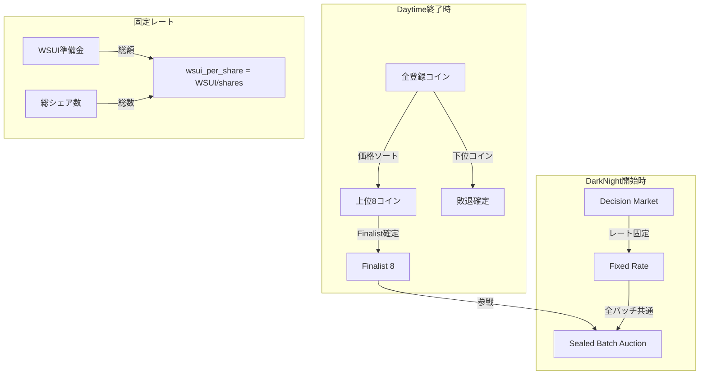
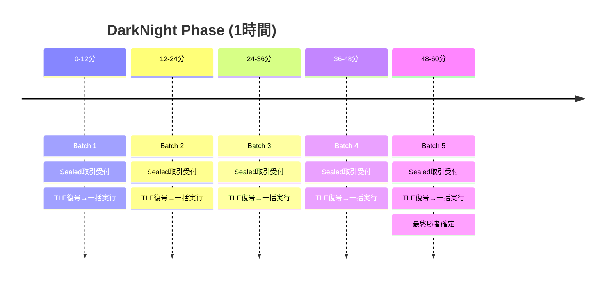
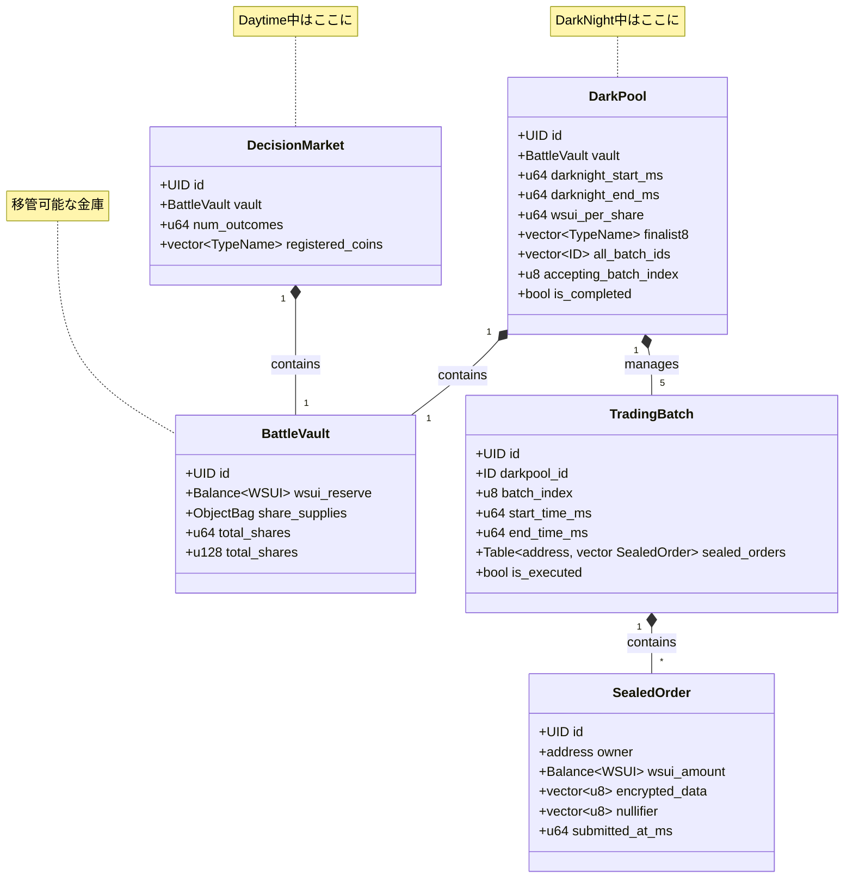
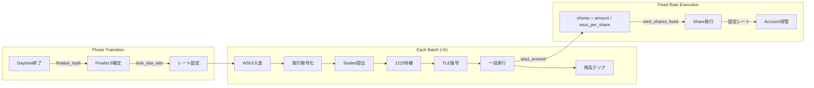
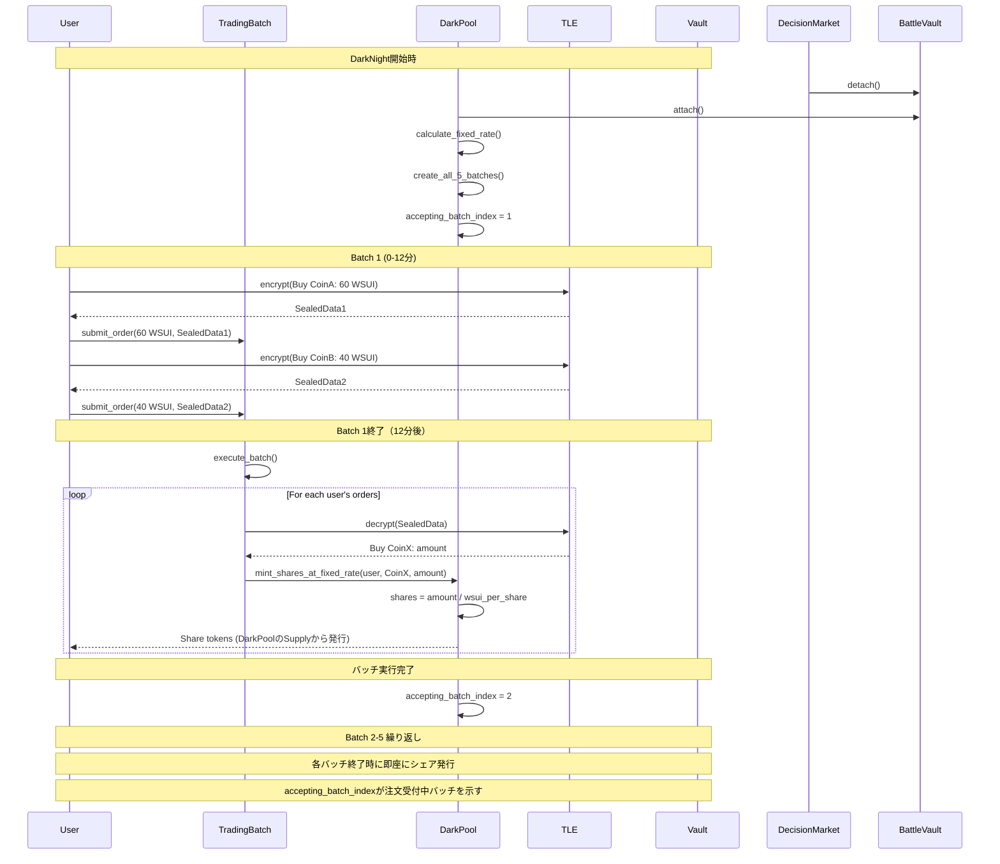
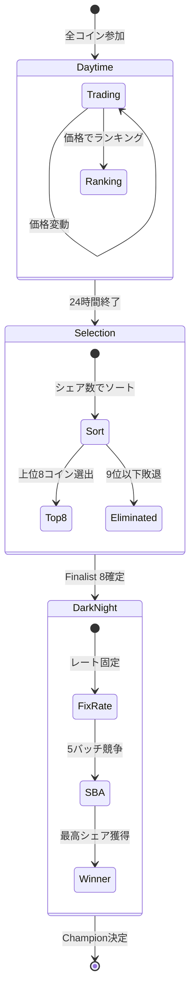

# Sealed Batch Auction (SBA) 設計

## 概要

Sealed Batch Auction (SBA)は、Time-Locked Encryption (TLE)を使用してフロントランニングを防止し、公平な価格発見を実現する革新的なオークションメカニズムです。BUMP.WINでは、DarkNight Phaseの1時間にわたってSBAが実行されます。

## 重要な前提条件

### 1. Finalist 8システム

- **Daytime終了時**: 上位8コインのみがDarkNightに進出
- **淘汰**: 残りのコインは敗退確定
- **目的**: 最終的な勝者選定の集中化

### 2. 固定レート制

- **レート固定時点**: DarkNight開始時（SBA開始時）
- **計算式**: `wsui_per_share = total_wsui_reserve / total_shares` (1シェア当たりのWSUI)
- **全バッチ共通**: 5つのバッチすべてで同一レートを使用
- **価格変動なし**: Brier Scoreによる価格計算は行わない

## システムアーキテクチャ



## 基本原則

### 1. WSUI専用取引

- **SUI → WSUI変換**: ユーザーは事前にSUIをWSUI Vaultに預けてWSUIを取得
- **WSUI入金**: DarkNight開始時にAccountへWSUIを入金
- **全額消費必須**: 入金したWSUIは必ず全額をBuy注文に使用

### 2. バッチ構造（5 × 12分）

- **総バッチ数**: 5個（定数: `TOTAL_BATCHES = 5`）
- **バッチ期間**: 各12分（定数: `BATCH_DURATION_MS = 720000`）
- **インデックス**: 1-5（1-indexed）



### 3. Sealed Transaction

- **TLE暗号化**: 取引内容を12分後まで秘匿
- **差し替え可能**: バッチ期間中は最新のSealed Txに更新可能
- **Nullifier管理**: 最新取引の識別

## アーキテクチャ

### Move構造体の関係（BattleVault中心設計）



### SBAの処理フロー



### モジュール構造

```move
module battle_vault::vault;

/// 移管可能な金庫（WSUI準備金とShare Supplyを保持）
public struct BattleVault has key, store {
    id: UID,
    /// WSUI準備金
    wsui_reserve: Balance<WSUI>,
    /// 各コインのSupply管理
    share_supplies: ObjectBag, // TypeName → Supply<Share<CoinT>>
    /// 総シェア数（メモ化）
    total_shares: u128,
}

module decision_market::market;

/// Decision Market（Daytime中にBattleVaultを保持）
public struct DecisionMarket has key {
    id: UID,
    /// 内包するVault（常に存在）
    vault: BattleVault,
    /// 登録されたアウトカム数
    num_outcomes: u64,
    /// 登録されたコインタイプ
    registered_coins: vector<TypeName>,
}

// DecisionMarket専用メソッド
public fun buy_shares<CoinT>(
    market: &mut DecisionMarket,
    payment: Coin<WSUI>,
    ctx: &mut TxContext
): Coin<Share<CoinT>> {
    // Brier Score計算による価格決定（Daytime専用）
    let vault = market.vault.borrow_mut();
    // ...
}

module sba::sealed_batch_auction;

/// DarkPool（DarkNight中にBattleVaultを保持）
public struct DarkPool has key {
    id: UID,
    /// 内包するVault（常に存在）
    vault: BattleVault,
    /// DarkNight開始/終了時刻
    darknight_start_ms: u64,
    darknight_end_ms: u64,
    /// 固定レート：1シェア当たりのWSUI
    wsui_per_share: u64,
    /// Finalist 8のコイン
    finalist8: vector<TypeName>,
    /// 全5バッチのID（事前作成済み）
    all_batch_ids: vector<ID>,
    /// 注文受付中のバッチインデックス（1-5）
    accepting_batch_index: u8,
    /// 完了フラグ
    is_completed: bool,
}

// 定数定義
const TOTAL_BATCHES: u8 = 5;
const BATCH_DURATION_MS: u64 = 720000; // 12分

// 注文受付中のバッチIDを取得
public fun get_accepting_batch_id(darkpool: &DarkPool): ID {
    assert!(darkpool.accepting_batch_index > 0 && darkpool.accepting_batch_index <= TOTAL_BATCHES, E_INVALID_BATCH_INDEX);
    darkpool.all_batch_ids[(darkpool.accepting_batch_index - 1) as u64]
}

/// 単一バッチの取引をまとめる構造体
public struct TradingBatch has key {
    id: UID,
    /// 所属するDarkPoolのID
    darkpool_id: ID,
    /// このバッチのインデックス（1-5）
    batch_index: u8,
    /// バッチ開始/終了時刻
    start_time_ms: u64,
    end_time_ms: u64,
    /// アドレス別のSealed注文（複数可）
    sealed_orders: Table<address, vector<SealedOrder>>,
    /// 実行済みフラグ
    is_executed: bool,
}
```

### Decision Market (Battle Vault) との関係

```move
/// Battle Vault = Decision Market実装
public struct BattleVault has key, store {
    id: UID,
    /// WSUI準備金（SUIではなくWSUI）
    wsui_reserve: Balance<WSUI>,
    /// 各コインのShare Supply管理
    supply_bag: ObjectBag, // TypeName → TokenSupply<CoinT>
    /// 各コインの管理情報
    num_outcomes: u64,
    total_shares: u128,
    round_id: u64,
}
```

## 取引フロー（DarkPool/TradingBatch設計）



### 1. Sealed注文の提出（TradingBatchへの追加）

```move
public fun submit_sealed_order(
    batch: &mut TradingBatch,
    wsui_payment: Coin<WSUI>,
    encrypted_data: vector<u8>,
    nullifier: vector<u8>,
    clock: &Clock,
    ctx: &mut TxContext
) {
    let sender = ctx.sender();
    let current_time = clock.timestamp_ms();

    // バッチ時間検証
    assert!(
        current_time >= batch.start_time_ms &&
        current_time < batch.end_time_ms,
        E_NOT_IN_BATCH_WINDOW
    );
    assert!(!batch.is_executed, E_BATCH_ALREADY_EXECUTED);

    // nullifierの重複チェック（全ユーザーの注文をスキャン）
    assert!(!is_nullifier_used(batch, &nullifier), E_NULLIFIER_ALREADY_USED);

    // 新しい注文を作成
    let sealed_order = SealedOrder {
        id: object::new(ctx),
        owner: sender,
        wsui_amount: wsui_payment.into_balance(),
        encrypted_data,
        nullifier,
        submitted_at_ms: current_time,
    };

    // ユーザーの注文リストに追加
    if (!batch.sealed_orders.contains(sender)) {
        batch.sealed_orders.add(sender, vector::empty());
    };
    let user_orders = batch.sealed_orders.borrow_mut(sender);
    user_orders.push_back(sealed_order);
}

fun is_nullifier_used(batch: &TradingBatch, nullifier: &vector<u8>): bool {
    // 全アドレスの注文をチェック
    let addresses = batch.sealed_orders.keys();
    let i = 0;
    while (i < addresses.length()) {
        let user_orders = batch.sealed_orders.borrow(&addresses[i]);
        let j = 0;
        while (j < user_orders.length()) {
            if (&user_orders[j].nullifier == nullifier) {
                return true
            };
            j = j + 1;
        };
        i = i + 1;
    };
    false
}

/// 特定の注文をキャンセル（nullifierで指定）
public fun cancel_sealed_order(
    batch: &mut TradingBatch,
    nullifier: vector<u8>,
    ctx: &mut TxContext
) {
    let sender = ctx.sender();
    assert!(!batch.is_executed, E_BATCH_ALREADY_EXECUTED);
    assert!(batch.sealed_orders.contains(sender), E_NO_ORDERS);

    // ユーザーの注文から該当するものを検索
    let user_orders = batch.sealed_orders.borrow_mut(sender);
    let (found, index) = find_order_by_nullifier(user_orders, &nullifier);
    assert!(found, E_ORDER_NOT_FOUND);

    // 注文を削除
    let order = user_orders.remove(index);

    // WSUIを返却
    transfer::public_transfer(
        order.wsui_amount.into_coin(ctx),
        sender
    );

    // SealedOrderオブジェクトを削除
    object::delete(order.id);

    // 空になったらエントリ自体を削除
    if (user_orders.is_empty()) {
        batch.sealed_orders.remove(sender);
    };
}

fun find_order_by_nullifier(
    orders: &vector<SealedOrder>,
    nullifier: &vector<u8>
): (bool, u64) {
    let i = 0;
    while (i < orders.length()) {
        if (&orders[i].nullifier == nullifier) {
            return (true, i)
        };
        i = i + 1;
    };
    (false, 0)
}
```

### 2. Vault移管とDarkPool作成

```move
/// 新しいTradingBatchを作成
fun create_trading_batch(
    darkpool: &mut DarkPool,
    batch_index: u8,
    clock: &Clock,
    ctx: &mut TxContext
): ID {
    assert!(batch_index >= 1 && batch_index <= TOTAL_BATCHES, E_INVALID_BATCH_INDEX);
    
    let start_time = darkpool.darknight_start_ms + ((batch_index - 1) as u64) * BATCH_DURATION_MS;
    
    let batch = TradingBatch {
        id: object::new(ctx),
        darkpool_id: object::id(darkpool),
        batch_index,
        start_time_ms: start_time,
        end_time_ms: start_time + BATCH_DURATION_MS,
        sealed_orders: table::new(ctx),
        is_executed: false,
    };
    
    let batch_id = object::id(&batch);
    transfer::share_object(batch);
    batch_id
}
```

### 3. Vault移管の実装

```move
/// DecisionMarketを破棄してBattleVaultを取り出す
public fun destroy_decision_market(
    market: DecisionMarket
): BattleVault {
    let DecisionMarket {
        id,
        vault,
        num_outcomes: _,
        registered_coins: _
    } = market;
    object::delete(id);
    vault
}

/// DarkPoolを作成（BattleVaultを移管）
public fun create_darkpool_with_vault(
    vault: BattleVault,
    finalist8: vector<TypeName>,
    clock: &Clock,
    ctx: &mut TxContext
): ID {
    let current_time = clock.timestamp_ms();

    // 固定レートを計算
    let total_wsui = vault.wsui_reserve.value();
    let total_shares = vault.total_shares;
    let wsui_per_share = total_wsui / (total_shares as u64);

    // DarkPoolを作成（Vaultを内包）
    let darkpool = DarkPool {
        id: object::new(ctx),
        vault,
        darknight_start_ms: current_time,
        darknight_end_ms: current_time + 3600000, // 60分
        wsui_per_share,
        finalist8,
        all_batch_ids: vector::empty(),
        accepting_batch_index: 0,
        is_completed: false,
    };

    let darkpool_id = object::id(&darkpool);
    
    // 全5バッチを事前作成
    let i = 0;
    while (i < TOTAL_BATCHES) {
        let batch_id = create_trading_batch(&mut darkpool, (i + 1), clock, ctx);
        darkpool.all_batch_ids.push_back(batch_id);
        i = i + 1;
    };
    
    // 最初のバッチへの注文受付開始
    darkpool.accepting_batch_index = 1;
    
    transfer::share_object(darkpool);
    darkpool_id
}

/// DarkPoolを破棄してBattleVaultを返却
public fun destroy_darkpool(
    darkpool: DarkPool
): BattleVault {
    assert!(darkpool.is_completed, E_DARKPOOL_NOT_COMPLETED);

    let DarkPool {
        id,
        vault,
        darknight_start_ms: _,
        darknight_end_ms: _,
        wsui_per_share: _,
        finalist8: _,
        all_batch_ids: _,
        accepting_batch_index: _,
        is_completed: _,
    } = darkpool;

    object::delete(id);
    vault
}

/// 使用例：フェーズ移行
public fun transition_to_darknight(
    market: DecisionMarket,
    finalist8: vector<TypeName>,
    clock: &Clock,
    ctx: &mut TxContext
): ID {
    // DecisionMarketを破棄してVaultを取得
    let vault = destroy_decision_market(market);

    // DarkPoolを作成（Vaultを移管）
    create_darkpool_with_vault(vault, finalist8, clock, ctx)
}

/// DarkPoolがシェアを発行
public fun mint_shares_from_darkpool<CoinT>(
    darkpool: &mut DarkPool,
    wsui_amount: u64,
    ctx: &mut TxContext
): Coin<Share<CoinT>> {
    let shares_to_mint = wsui_amount / darkpool.wsui_per_share;

    // WSUIを受け取る
    darkpool.vault.wsui_reserve.join(coin::into_balance(wsui_payment));

    // 対応するSupplyからシェアを発行
    let coin_type = type_name::get<CoinT>();
    let supply = darkpool.vault.share_supplies.borrow_mut<TypeName, Supply<Share<CoinT>>>(coin_type);
    let shares = supply.increase_supply(shares_to_mint);

    coin::from_balance(shares, ctx)
}
```

### 4. バッチ実行

```move
/// バッチ終了時の一括実行
public fun execute_batch(
    darkpool: &mut DarkPool,
    batch: &mut TradingBatch,
    clock: &Clock,
    ctx: &mut TxContext
) {
    let current_time = clock.timestamp_ms();
    
    // 実行条件の検証
    assert!(current_time >= batch.end_time_ms, E_BATCH_NOT_ENDED);
    assert!(!batch.is_executed, E_BATCH_ALREADY_EXECUTED);
    assert!(batch.darkpool_id == object::id(darkpool), E_BATCH_MISMATCH);
    assert!(batch.batch_index == darkpool.accepting_batch_index, E_NOT_ACCEPTING_BATCH);
    
    // 全ユーザーの注文を処理
    let addresses = batch.sealed_orders.keys();
    let i = 0;
    while (i < addresses.length()) {
        let user_address = &addresses[i];
        let user_orders = batch.sealed_orders.borrow(user_address);
        
        let j = 0;
        while (j < user_orders.length()) {
            let order = &user_orders[j];
            
            // TLE復号化
            let decrypted_data = decrypt_sealed_order(&order.encrypted_data, batch.end_time_ms);
            let (coin_type, action) = parse_decrypted_data(decrypted_data);
            
            // 固定レートでシェア発行
            if (action == ACTION_BUY) {
                let shares_amount = order.wsui_amount.value() / darkpool.wsui_per_share;
                mint_shares_to_user(darkpool, user_address, coin_type, shares_amount, ctx);
            };
            
            j = j + 1;
        };
        i = i + 1;
    };
    
    // バッチを実行済みに設定
    batch.is_executed = true;
    
    // 次のバッチへの注文受付開始（最終バッチでなければ）
    if (darkpool.accepting_batch_index < TOTAL_BATCHES) {
        darkpool.accepting_batch_index = darkpool.accepting_batch_index + 1;
    } else {
        darkpool.is_completed = true;
    };
}
```

### 5. 元のバッチ処理関数（参考）

```move
public fun deposit_wsui_for_batch(
    round: &BattleRound,
    account: &mut BattleAccount,
    wsui_coin: Coin<WSUI>,
    target_batch_index: u8,
    clock: &Clock,
) {
    // バッチインデックスとタイミング検証
    let phase = get_current_phase(round, clock);
    assert!(
        matches!(phase, RoundPhase::DarkNight { batch, .. }) && batch == target_batch_index,
        E_WRONG_BATCH
    );

    // 新バッチなら前バッチの完了確認
    if (account.current_batch != target_batch_index) {
        assert!(account.wsui_balance.value() == 0, E_PREVIOUS_BATCH_NOT_CONSUMED);
        account.current_batch = target_batch_index;
        account.batch_start_ms = get_batch_start_time(round, target_batch_index);
    }

    account.wsui_balance.join(wsui_coin.into_balance());
}
```

### 2. Sealed取引の提出（詳細は後述）

```move
public fun submit_sealed_transaction(
    account: &mut BattleAccount,
    sealed_tx: SealedTransaction,
    nullifier: vector<u8>,
) {
    // 最新性確認（Nullifierチェック）
    // 既存取引の置き換え
    account.pending_sealed_tx = option::some(sealed_tx);
}
```

### 3. バッチ終了時の実行

```move
public fun execute_batch_for_account(
    round: &mut BattleRound,
    vault: &mut BattleVault,  // Decision Market
    account: &mut BattleAccount,
    target_batch_index: u8,
    clock: &Clock,
) {
    // バッチ終了確認
    assert!(is_batch_ended(round, target_batch_index, clock), E_BATCH_NOT_ENDED);
    assert!(account.current_batch == target_batch_index, E_WRONG_BATCH);

    // Sealed取引の復号化と実行
    if (account.pending_sealed_tx.is_some()) {
        let sealed_tx = account.pending_sealed_tx.extract();
        let unsealed_tx = decrypt_with_tle(sealed_tx, target_batch_index);
        execute_unsealed_transaction(vault, account, unsealed_tx);
    }

    // 全WSUI消費確認（SBAの鉄則）
    assert!(account.wsui_balance.value() == 0, E_UNUSED_WSUI_IN_SBA);

    // 次バッチの準備
    account.pending_sealed_tx = option::none();
}
```

### 6. Share発行メカニズム（固定レート）

DarkPoolは`wsui_per_share`フィールドを直接保持し、この固定レートを使用して全バッチでシェアを発行します。

```move
/// 固定レートでのShare購入（DarkPool内で実行）
fun mint_shares_to_user(
    darkpool: &mut DarkPool,
    user: &address,
    coin_type: TypeName,
    shares_amount: u64,
    ctx: &mut TxContext
) {
    // DarkPoolのVaultからShareを発行
    let supply = darkpool.vault.share_supplies.borrow_mut<TypeName, Supply<Share<CoinT>>>(coin_type);
    let shares = supply.increase_supply(shares_amount);
    
    // ユーザーにShareを転送
    transfer::public_transfer(
        coin::from_balance(shares, ctx),
        *user
    );
}
```

## Finalist 8の実装



```move
public fun finalize_top8(
    round: &mut BattleRound,
    vault: &BattleVault,
    clock: &Clock,
) {
    assert!(is_daytime_end(round, clock), E_NOT_DAYTIME_END);

    // 全コインの価格（シェア数）を取得してソート
    let mut coin_shares: vector<CoinShareInfo> = vector[];
    let coin_types = vault.get_all_coin_types();

    let i = 0;
    while (i < coin_types.length()) {
        let coin_type = coin_types[i];
        let shares = vault.get_share_count(coin_type);
        coin_shares.push_back(CoinShareInfo { coin_type, shares });
        i = i + 1;
    };

    // シェア数でソート（降順）
    sort_by_shares_desc(&mut coin_shares);

    // 上位8コインを確定
    let mut finalist8 = vector[];
    let j = 0;
    while (j < 8 && j < coin_shares.length()) {
        finalist8.push_back(coin_shares[j].coin_type);
        j = j + 1;
    };

    round.finalist8 = finalist8;

    // レート固定も同時に実行
    lock_sba_rate(vault, round, clock);
}
```

## セキュリティ保証

### 1. Time-Locked Encryption

- **暗号化期間**: 各バッチ12分間
- **復号化**: バッチ終了時にのみ可能
- **Sui Seal統合**: ネイティブTLEサポート

### 2. 全額消費保証

- **設計思想**: 真剣勝負での中途半端な賭けを防止
- **実装**: バッチ終了時の残高ゼロ確認
- **メリット**: 価格操作の余地を削減

### 3. Nullifier による二重実行防止

- **最新性保証**: 常に最新のSealed Txのみ実行
- **差し替え追跡**: 取引更新履歴の管理

## 実装上の注意点

### 1. ガス効率

- **バッチ実行**: 複数アカウントの一括処理検討
- **Storage最適化**: Sealed Tx のサイズ制限

### 2. タイミング精度

- **Clock依存**: Sui Clockの精度に依存
- **Grace Period**: ネットワーク遅延の考慮

### 3. エラーハンドリング

- **部分実行防止**: Buy注文の原子性保証
- **リカバリ**: 失敗時のWSUI返却メカニズム

## 今後の拡張

### 1. Switch取引の実装

- **Sell + Buy**: 2段階取引の原子性
- **価格影響**: 固定レートでの取引（DarkNight中はBrier Scoreは使用しない）

### 2. 高度な注文タイプ

- **条件付き注文**: 価格閾値での実行
- **分割注文**: 複数コインへの分散投資

### 3. MEV対策の強化

- **コミット・リビール**: 追加の秘匿層
- **閾値暗号**: 分散型TLE実装
