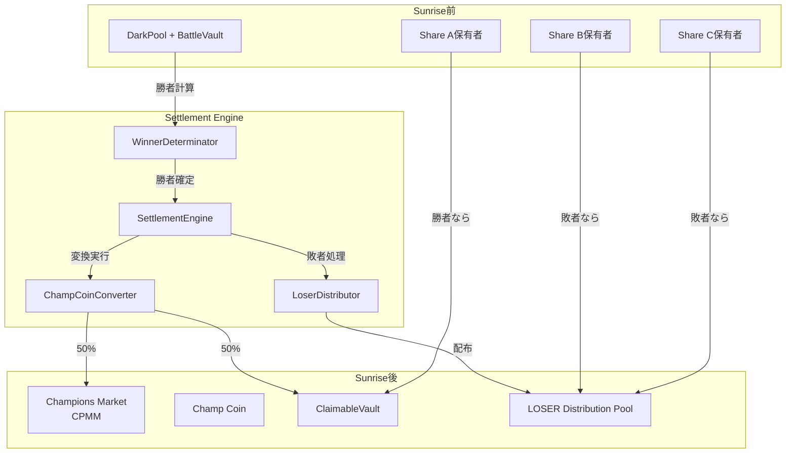

# Sunrise Settlement 設計

## 概要

Sunrise Settlementは、BUMP.WINのバトルラウンド終了後に実行される清算・勝者確定フェーズです。DarkNightの第5バッチ終了直後に自動的に起動し、以下の処理を実行します：

1. 勝者ミームコインの確定
2. Champ Coinへの変換と価値再評価
3. Champions AMM（CPMM）の生成
4. LOSER配布計算と実行
5. 次ラウンドの自動開始

## システムアーキテクチャ



## Move構造体設計

### 1. Settlement Engine

```move
module sunrise::settlement_engine;

/// Settlement実行のための中央制御構造体
public struct SettlementEngine has key {
    id: UID,
    /// 現在のラウンド番号
    round_number: u64,
    /// Settlement実行済みフラグ
    is_settled: bool,
    /// 勝者コインタイプ
    winner_coin_type: Option<TypeName>,
    /// LOSER配布レート（ラウンドごとに逓減）
    loser_distribution_rate: u64,
}

/// 勝者確定結果
public struct WinnerResult has store {
    /// 勝者コインタイプ
    coin_type: TypeName,
    /// 勝率（シェア比率）
    win_rate: u64, // basis points (10000 = 100%)
    /// 総シェア数
    total_shares: u128,
    /// 勝者シェア数
    winner_shares: u128,
}
```

### 2. Champ Coin変換

```move
module champ_coin::converter;

/// Champ Coin変換レコード
public struct ChampConversion has key {
    id: UID,
    /// 元のコインタイプ
    original_coin_type: TypeName,
    /// 変換レート（1 share = X champ coins）
    conversion_rate: u64,
    /// 総発行量（= Battle Vault WSUI残高 × 2）
    total_supply: u64,
    /// AMM配分量（50%）
    amm_allocation: u64,
    /// Claim可能量（50%）
    claimable_allocation: u64,
}

/// Claim可能な残高管理
public struct ClaimableVault has key {
    id: UID,
    /// ラウンド番号
    round_number: u64,
    /// Champ Coin残高
    champ_balance: Balance<ChampCoin>,
    /// Share保有者別のClaim権（address → claim可能量）
    claim_rights: Table<address, u64>,
    /// Claim実行記録
    claimed_records: Table<address, bool>,
}
```

### 3. 処理フロー

```move
/// Sunrise Settlement実行
public fun execute_sunrise_settlement(
    engine: &mut SettlementEngine,
    darkpool: DarkPool,
    clock: &Clock,
    ctx: &mut TxContext
) {
    assert!(!engine.is_settled, E_ALREADY_SETTLED);
    assert!(darkpool.is_completed, E_DARKPOOL_NOT_COMPLETED);

    // 1. DarkPoolを破棄してBattleVaultを取得
    let vault = destroy_darkpool(darkpool);

    // 2. 勝者確定
    let winner = determine_winner(&vault);
    engine.winner_coin_type = option::some(winner.coin_type);

    // 3. Champ Coin変換準備
    let total_wsui = vault.wsui_reserve.value();
    let champ_supply = winner.winner_shares * 2; // 勝者シェア数の2倍

    // 4. Champ Coin発行と配分
    let (amm_coins, claimable_coins) = mint_and_split_champ_coins(
        &winner,
        champ_supply,
        ctx
    );

    // 5. ClaimableVault作成
    create_claimable_vault(
        engine.round_number,
        claimable_coins,
        &winner,
        &vault,
        ctx
    );

    // 6. Champions Market (CPMM) 作成
    create_champions_market(
        vault.wsui_reserve,
        amm_coins,
        &winner,
        ctx
    );

    // 7. LOSER配布計算と実行
    distribute_loser_tokens(
        &vault,
        &winner,
        engine.loser_distribution_rate,
        ctx
    );

    // 8. Settlement完了
    engine.is_settled = true;

    // 9. 次ラウンド準備
    prepare_next_round(engine, ctx);
}
```

### 4. 勝者確定ロジック

#### 基本アルゴリズム

```move
/// 勝者を確定する
fun determine_winner(vault: &BattleVault): WinnerResult {
    let coin_types = vault.get_all_coin_types();
    let mut max_shares = 0u128;
    let mut winner_type = type_name::get<DummyCoin>();
    let mut total_shares = 0u128;

    // 各コインのシェア数を集計
    let i = 0;
    while (i < coin_types.length()) {
        let coin_type = &coin_types[i];
        let shares = vault.get_share_count(coin_type);
        total_shares = total_shares + shares;

        if (shares > max_shares) {
            max_shares = shares;
            winner_type = *coin_type;
        };
        i = i + 1;
    };

    // 勝率計算（basis points）
    let win_rate = ((max_shares as u64) * 10000) / (total_shares as u64);

    WinnerResult {
        coin_type: winner_type,
        win_rate,
        total_shares,
        winner_shares: max_shares,
    }
}

/// 同率一位の場合のタイブレーカー
fun handle_tie_breaker(
    vault: &BattleVault,
    tied_coins: vector<TypeName>,
    clock: &Clock
): TypeName {
    // 方法1: 総取引量で決定
    let mut max_volume = 0u64;
    let mut winner = tied_coins[0];

    let i = 0;
    while (i < tied_coins.length()) {
        let volume = vault.get_total_volume(&tied_coins[i]);
        if (volume > max_volume) {
            max_volume = volume;
            winner = tied_coins[i];
        };
        i = i + 1;
    };

    // 方法2: それでも同じ場合はハッシュ値で決定（決定論的）
    if (all_volumes_equal(&tied_coins, vault)) {
        winner = select_by_hash(&tied_coins, clock.timestamp_ms());
    };

    winner
}
```

### 5. Champ Coin発行

```move
/// Champ Coinを発行して分割
fun mint_and_split_champ_coins(
    winner: &WinnerResult,
    total_supply: u64,
    ctx: &mut TxContext
): (Coin<ChampCoin>, Coin<ChampCoin>) {
    // Champ Coin Supply作成（一度だけ）
    let supply = champ_coin::create_supply(
        winner.coin_type,
        total_supply,
        ctx
    );

    // 全量発行
    let all_coins = supply.mint(total_supply, ctx);

    // 勝者シェア数で分割（1:1変換用 + AMM用）
    let winner_share_count = winner.winner_shares as u64;
    let claimable_coins = all_coins.split(winner_share_count, ctx);
    let amm_coins = all_coins; // 残り（同じく winner_share_count 枚）

    (amm_coins, claimable_coins)
}
```

### 6. ClaimableVault作成

```move
/// Claim可能な金庫を作成
fun create_claimable_vault(
    round_number: u64,
    claimable_coins: Coin<ChampCoin>,
    winner: &WinnerResult,
    vault: &BattleVault,
    ctx: &mut TxContext
) {
    let mut claim_rights = table::new(ctx);

    // 各Share保有者のClaim権を計算
    let share_holders = vault.get_share_holders(winner.coin_type);
    let i = 0;
    while (i < share_holders.length()) {
        let holder = &share_holders[i];
        let share_amount = vault.get_share_balance(winner.coin_type, holder);

        // Claim可能量 = 保有share数（1:1変換）
        let claimable = share_amount as u64;
        claim_rights.add(*holder, claimable);

        i = i + 1;
    };

    let vault = ClaimableVault {
        id: object::new(ctx),
        round_number,
        champ_balance: claimable_coins.into_balance(),
        claim_rights,
        claimed_records: table::new(ctx),
    };

    transfer::share_object(vault);

    // Share保有者に通知（イベント発行）
    let i = 0;
    while (i < share_holders.length()) {
        event::emit(ClaimRightCreated {
            round_number,
            holder: share_holders[i],
            claimable_amount: *claim_rights.borrow(&share_holders[i]),
            original_shares: vault.get_share_balance(winner.coin_type, &share_holders[i]),
        });
        i = i + 1;
    };
}

/// Claim権利作成イベント
event ClaimRightCreated has copy, drop {
    round_number: u64,
    holder: address,
    claimable_amount: u64,
    original_shares: u128,
}
```

### 7. Champions Market作成

#### CPMMアーキテクチャ

```move
/// Champions Market (CPMM)を作成
fun create_champions_market(
    wsui_reserve: Balance<WSUI>,
    champ_coins: Coin<ChampCoin>,
    winner: &WinnerResult,
    ctx: &mut TxContext
) {
    // CPMMプールを初期化（1:1の比率）
    let pool = cpmm::create_pool_with_liquidity(
        wsui_reserve.into_coin(ctx),
        champ_coins,
        1, // 初期価格 1 WSUI = 1 Champ
        100, // 1%手数料（basis points）
        ctx
    );

    // 手数料収益はLOSERステーカーへ
    pool.set_fee_recipient(get_loser_staking_pool());

    transfer::share_object(pool);

    // Champions Market作成イベント
    event::emit(ChampionsMarketCreated {
        round_number: engine.round_number,
        champ_coin_type: winner.coin_type,
        initial_wsui: wsui_reserve.value(),
        initial_champ: champ_coins.value(), // winner_shares数と同じ
        fee_rate: 100, // 1%
    });
}

/// Champions MarketのCPMM構造体
public struct ChampionsMarket<phantom T> has key {
    id: UID,
    /// ラウンド番号
    round_number: u64,
    /// WSUIリザーブ
    wsui_reserve: Balance<WSUI>,
    /// Champ Coinリザーブ（winner_shares数）
    champ_reserve: Balance<ChampCoin<T>>,
    /// LPトークンSupply
    lp_supply: Supply<ChampLP<T>>,
    /// 取引手数料率（basis points）
    fee_rate: u64,
    /// 手数料収益の送付先（LOSERステーキングプール）
    fee_recipient: address,
    /// 初期価格（WSUI per Champ）
    initial_price: u64, // total_wsui / winner_shares
}

/// Champions MarketのLPトークン
public struct ChampLP<phantom T> has drop {}

event ChampionsMarketCreated has copy, drop {
    round_number: u64,
    champ_coin_type: TypeName,
    initial_wsui: u64,
    initial_champ: u64,
    fee_rate: u64,
}
```

### 8. LOSER配布

#### 配布アルゴリズム

```move
/// LOSER配布を実行
fun distribute_loser_tokens(
    vault: &BattleVault,
    winner: &WinnerResult,
    distribution_rate: u64,
    ctx: &mut TxContext
) {
    let total_wsui = vault.wsui_reserve.value();
    let loser_mint_amount = calculate_loser_mint_amount(
        total_wsui,
        distribution_rate
    );

    // 敗者コインのシェア保有者を特定
    let coin_types = vault.get_all_coin_types();
    let mut loser_distributions = table::new(ctx);

    let i = 0;
    while (i < coin_types.length()) {
        let coin_type = &coin_types[i];

        // 勝者以外が敗者
        if (coin_type != &winner.coin_type) {
            let share_count = vault.get_share_count(coin_type);
            let share_value = (share_count * total_wsui) / vault.total_shares;

            // 各敗者コイン保有者への配布計算
            distribute_to_losers(
                coin_type,
                share_value,
                loser_mint_amount,
                &mut loser_distributions,
                vault
            );
        };
        i = i + 1;
    };

    // 実際の配布実行
    execute_loser_distribution(loser_distributions, ctx);
}

/// LOSER発行量計算（ラウンドごとに逓減）
fun calculate_loser_mint_amount(
    total_wsui: u64,
    distribution_rate: u64 // basis points
): u64 {
    (total_wsui * distribution_rate) / 10000
}

/// 次ラウンドのLOSERレート計算
fun calculate_next_loser_rate(round_number: u64): u64 {
    // 初期: 100 LOSER per SUI (1000000 basis points)
    // 最終: 1 LOSER per SUI (10000 basis points)
    let initial_rate = 1000000u64;
    let final_rate = 10000u64;
    let total_rounds = 100u64; // 例: 100ラウンドで最小値に

    if (round_number >= total_rounds) {
        final_rate
    } else {
        let decay = (initial_rate - final_rate) * round_number / total_rounds;
        initial_rate - decay
    }
}

/// 各敗者コイン保有者への配布計算
fun distribute_to_losers(
    coin_type: &TypeName,
    share_value: u64, // このコインの総時価
    total_loser_amount: u64,
    distributions: &mut Table<address, u64>,
    vault: &BattleVault
) {
    let holders = vault.get_share_holders(coin_type);
    let total_loser_value = calculate_total_loser_value(vault);

    let i = 0;
    while (i < holders.length()) {
        let holder = &holders[i];
        let holder_shares = vault.get_share_balance(coin_type, holder);
        let holder_value = (holder_shares * share_value) / vault.get_share_count(coin_type);

        // LOSER配布量 = (保有時価 / 敗者総時価) * 総LOSER発行量
        let loser_amount = (holder_value * total_loser_amount) / total_loser_value;

        if (distributions.contains(*holder)) {
            let existing = distributions.borrow_mut(*holder);
            *existing = *existing + loser_amount;
        } else {
            distributions.add(*holder, loser_amount);
        };

        i = i + 1;
    };
}

/// LOSERトークン構造体
public struct LOSER has drop {}

/// LOSER Supply管理
public struct LOSERSupply has key {
    id: UID,
    supply: Supply<LOSER>,
    /// 総発行上限
    max_supply: u64,
    /// 現在の発行済み量
    total_minted: u64,
}
```

## Champ Coin変換の詳細設計

### 価値再評価メカニズム（1:1変換 + AMM価格上昇）

```move
/// Champ Coin発行量計算
/// 重要: Share<T>からChamp Coinへは1:1変換
/// 価値上昇はAMM価格で実現される
fun calculate_champ_supply(
    winner: &WinnerResult
): u64 {
    // Total Supply = 勝者シェア数 × 2
    // 50%: Claim用（1:1変換）
    // 50%: AMM用（WSUIとペア）
    (winner.winner_shares as u64) * 2
}

/// 具体例：
/// - Total WSUI: 600
/// - Winner shares: 60 (60%)
/// - Champ Total Supply: 120枚
/// - Claim用: 60枚（60シェア → 60 Champ、1:1変換）
/// - AMM用: 60枚（600 WSUIとペア → 1 Champ = 10 WSUI）
/// 
/// 価値上昇の実現：
/// - Sunrise前: 1 Share<A> = 6 WSUI（60% × 600/100）
/// - Sunrise後: 1 Champ = 10 WSUI（AMM初期価格）
/// - 上昇率: 67%（6 → 10 WSUI）
```

### Champ Coin Supply管理

```move
module champ_coin::champ_coin;

/// Champ Coinの一意性を保証するSupply
public struct ChampSupply<phantom T> has key {
    id: UID,
    /// 元のコインタイプ
    original_type: TypeName,
    /// ラウンド番号
    round_number: u64,
    /// Supply本体
    supply: Supply<ChampCoin<T>>,
    /// 総発行量
    total_supply: u64,
    /// 発行済み量
    minted: u64,
}

/// Champ Coinトークン
public struct ChampCoin<phantom T> has drop {}

/// Supply作成（一度だけ）
public fun create_supply<T>(
    original_type: TypeName,
    round_number: u64,
    total_supply: u64,
    ctx: &mut TxContext
): ChampSupply<T> {
    ChampSupply {
        id: object::new(ctx),
        original_type,
        round_number,
        supply: coin::create_supply(ChampCoin<T> {}, ctx),
        total_supply,
        minted: 0,
    }
}
```

## 重要な設計判断

### 1. 価値再評価メカニズム（AMM価格による実現）

```move
/// 価値上昇はAMM初期価格で実現される
/// 
/// 計算例（勝率60%の場合）：
/// - Battle中: 1 Share<A> = 0.6 × (total_wsui/total_shares) = 6 WSUI
/// - AMM価格: 1 Champ = total_wsui/winner_shares = 600/60 = 10 WSUI
/// - 上昇率: 10/6 = 1.67倍（67%上昇）
/// 
/// 計算例（勝率20%の場合）：
/// - Battle中: 1 Share<B> = 0.2 × (total_wsui/total_shares) = 2 WSUI
/// - AMM価格: 1 Champ = total_wsui/winner_shares = 600/20 = 30 WSUI
/// - 上昇率: 30/2 = 15倍（1400%上昇）
fun calculate_amm_initial_price(
    total_wsui: u64,
    winner_shares: u128
): u64 {
    total_wsui / (winner_shares as u64)
}
```

### 2. 一括処理 vs 遅延Claim

- **Champ Coin**: ClaimableVault経由で遅延Claim（ガス効率）
- **LOSER**: 一括配布（公平性重視）

#### 手数料収益の流れ

```move
/// Champions Marketでの取引手数料をLOSERステーカーに配分
fun distribute_trading_fees(
    market: &mut ChampionsMarket<T>,
    fee_amount: Balance<WSUI>
) {
    // LOSERステーキングプールに手数料を転送
    let loser_pool = get_loser_staking_pool();
    loser_pool.add_rewards(fee_amount);

    event::emit(TradingFeeDistributed {
        market_id: object::id(market),
        fee_amount: fee_amount.value(),
        recipient_pool: object::id(loser_pool),
    });
}
```

### 3. 状態遷移の原子性

```move
/// DarkPool → Settlement → 次ラウンドは原子的に実行
/// 中間状態での停止を防ぐ
///
/// トランザクションフロー:
/// 1. DarkPoolの完了確認
/// 2. BattleVaultの移管
/// 3. 勝者確定と価値計算
/// 4. Champ Coin発行と配分
/// 5. Champions Market作成
/// 6. LOSER配布
/// 7. 次ラウンド準備
///
/// いずれかのステップで失敗した場合、
/// トランザクション全体がロールバック
```

## セキュリティ考慮事項

1. **二重Settlement防止**: `is_settled`フラグで制御
2. **Claim権の検証**:
   - Share保有量に基づく厳密な計算
   - 二重Claim防止
   - 有効期限なし（永続Claim可能）
3. **Supply管理**: Champ Coin Supplyは一度だけ作成
4. **時間制約**: Sunrise実行はDarkPool完了後のみ

## Claimメカニズム

```move
/// Share保有者がChamp CoinをClaim
public fun claim_champ_coins(
    vault: &mut ClaimableVault,
    ctx: &mut TxContext
): Coin<ChampCoin> {
    let sender = ctx.sender();

    // Claim権確認
    assert!(vault.claim_rights.contains(sender), E_NO_CLAIM_RIGHT);
    assert!(!vault.claimed_records.contains(sender), E_ALREADY_CLAIMED);

    // Claim可能量取得
    let claimable = vault.claim_rights.borrow(sender);

    // Champ Coinを分離
    let champ_coin = coin::from_balance(
        vault.champ_balance.split(*claimable),
        ctx
    );

    // Claim記録
    vault.claimed_records.add(sender, true);

    // イベント発行
    event::emit(ChampCoinClaimed {
        round_number: vault.round_number,
        claimer: sender,
        amount: *claimable,
    });

    champ_coin
}
```

## 次ラウンドへの移行

```move
/// 次ラウンドの準備
fun prepare_next_round(
    engine: &mut SettlementEngine,
    ctx: &mut TxContext
) {
    // ラウンド番号インクリメント
    engine.round_number = engine.round_number + 1;
    engine.is_settled = false;
    engine.winner_coin_type = option::none();

    // LOSER配布レート更新（逓減）
    engine.loser_distribution_rate = calculate_next_loser_rate(
        engine.round_number
    );

    // 新しいDecisionMarket作成はBattleRoundManagerが担当
}
```
